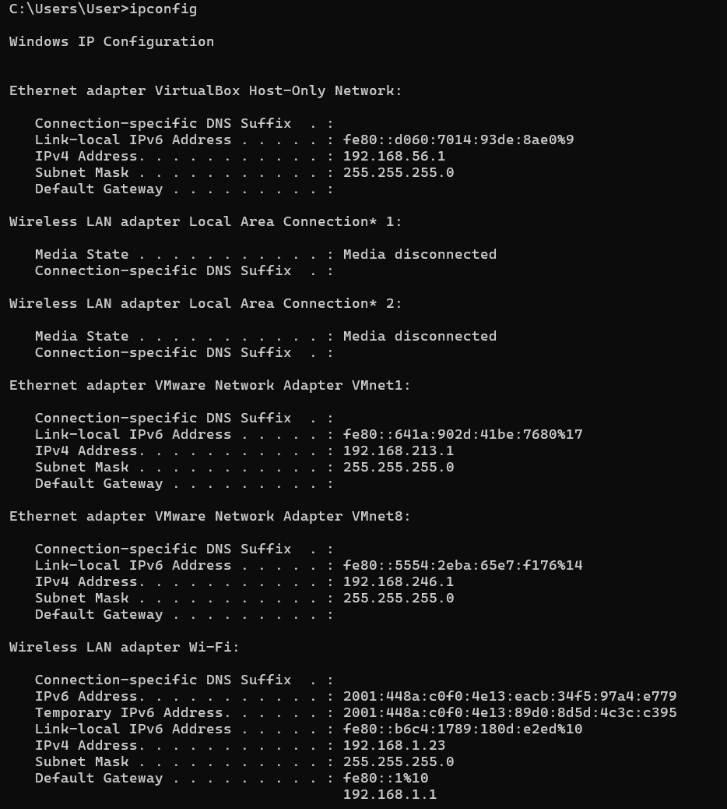

### **Difa Auliya Andini Putri - 103072400112**

# **Laporan Praktikum Modul 10: IP**

### **Tujuan Praktikum**
Mahasiswa dapat menginvestigasi cara kerja protokol IP menggunakan Wireshark.

### **IP Address**
IP Address (Internet Protocol Address) merupakan alamat logis unik yang digunakan untuk mengidentifikasi setiap perangkat yang terhubung dalam suatu jaringan, baik jaringan lokal (LAN) maupun internet. Fungsi utama IP Address adalah sebagai identitas perangkat sekaligus penentu tujuan pengiriman data, sehingga paket yang dikirim dapat sampai ke perangkat yang benar. Secara sederhana, IP Address dapat dianalogikan seperti alamat rumah—tanpa alamat yang jelas, data tidak akan mengetahui ke mana harus dikirim.

### **Jenis-Jenis Ip Address**
**IPv4 (Internet Protocol Version 4)** 
IPv4 adalah versi IP yang paling umum digunakan saat ini dan memiliki panjang 32-bit yang dibagi menjadi 4 oktet (masing-masing 8 bit). Setiap oktet bernilai 0–255. 
**Contoh: 192.168.1.1**

**IPv6 (Internet Protocol Version 6)** 
IPv6 merupakan versi terbaru yang dikembangkan karena keterbatasan jumlah alamat IPv4. IPv6 menggunakan 128-bit address dan ditulis dalam format heksadesimal. 
**Contoh: 2001:db8::1**

### **Cara menghitung IPv4:**
Alamat IPv4 terdiri dari 4 bagian angka (oktet),
dan setiap oktet dapat dikonversi ke bentuk biner.

Contoh: 192.168.1.1

**Konversi:**
- 192 = 11000000
- 168 = 10101000
- 1 = 00000001
- 1 = 00000001

Dengan memahami bentuk biner ini, kita dapat menentukan pembagian antara Network ID dan Host ID menggunakan subnet mask.

**Subnetting** 
Subnetting adalah proses membagi IP Address menjadi: 
**Network ID**, Bagian yang menunjukkan jaringan tempat perangkat berada. 
**Host ID**Bagian yang menunjukkan identitas perangkat dalam jaringan tersebut. 
Sebagai contoh, subnet mask 255.255.255.0 atau /24 berarti 24 bit pertama digunakan untuk network dan 8 bit terakhir digunakan untuk host.

Mengamati IP Address di perangkat: 

 

Berdasarkan hasil ipconfig, perangkat utama yang terhubung melalui Wi-Fi menggunakan:
- IPv4 Address: 192.168.1.23
- Subnet Mask: 255.255.255.0
- Default Gateway: 192.168.1.1

**Analisis**

Alamat 192.168.1.23 termasuk dalam kategori Private IP Class C, karena berada pada rentang 192.168.x.x yang umum digunakan pada jaringan lokal seperti rumah, sekolah, atau kantor.

Dengan subnet mask 255.255.255.0 (/24):

- Network ID: 192.168.1.0
- Host ID: 23
- Broadcast Address: 192.168.1.255

Jumlah host maksimum dalam jaringan: 
2^(32−24)−2 = 254

Artinya, jaringan ini dapat menampung hingga 254 perangkat aktif.

Default Gateway 192.168.1.1 berfungsi sebagai router utama yang menghubungkan perangkat ke internet atau jaringan luar.

### **IPv6 pada Perangkat**

Perangkat juga memiliki alamat IPv6, baik dalam bentuk global maupun link-local, yang memiliki kapasitas alamat jauh lebih besar dibanding IPv4.