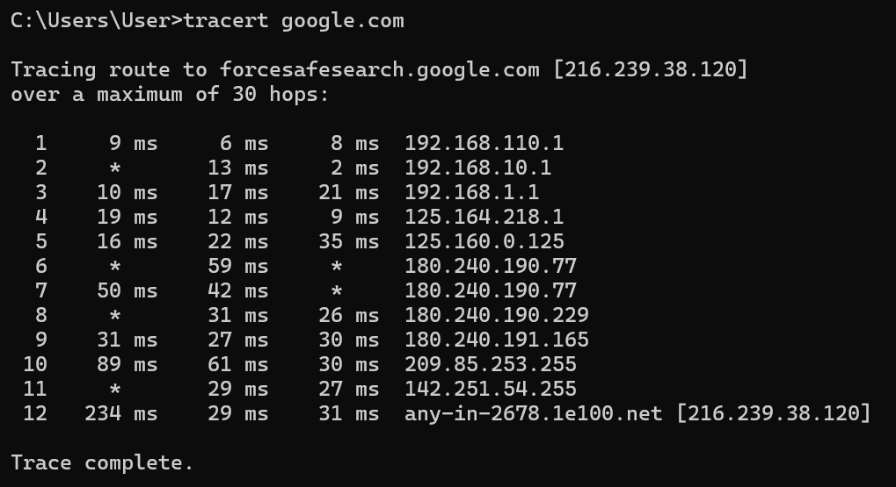
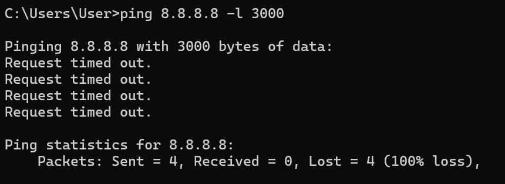
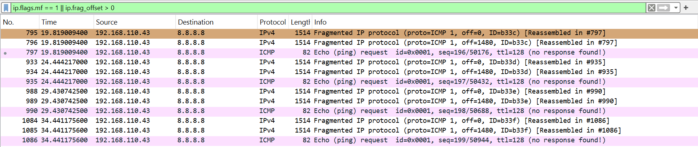
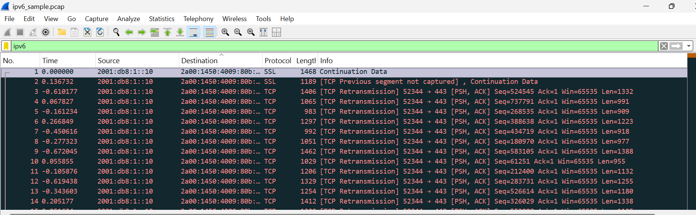
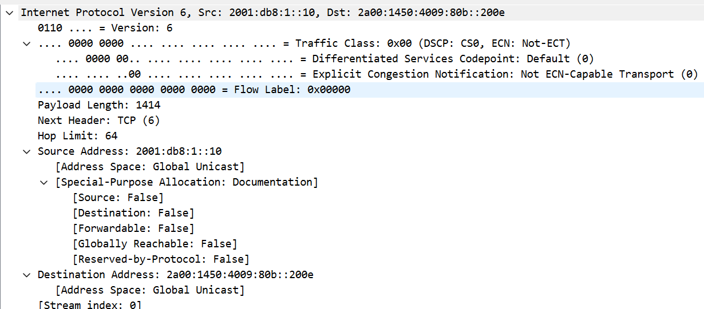

### **Difa Auliya Andini Putri - 103072400112**

# **Laporan Praktikum Modul 10: IP**

### **Tujuan Praktikum**
Mahasiswa dapat menginvestigasi cara kerja protokol IP menggunakan Wireshark.

### **IP Address**
IP Address (Internet Protocol Address) merupakan alamat logis unik yang digunakan untuk mengidentifikasi setiap perangkat yang terhubung dalam suatu jaringan, baik jaringan lokal (LAN) maupun internet. Fungsi utama IP Address adalah sebagai identitas perangkat sekaligus penentu tujuan pengiriman data, sehingga paket yang dikirim dapat sampai ke perangkat yang benar. Secara sederhana, IP Address dapat dianalogikan seperti alamat rumah—tanpa alamat yang jelas, data tidak akan mengetahui ke mana harus dikirim.

### **Jenis-Jenis Ip Address**
**IPv4 (Internet Protocol Version 4)** 
IPv4 adalah versi IP yang paling umum digunakan saat ini dan memiliki panjang 32-bit yang dibagi menjadi 4 oktet (masing-masing 8 bit). Setiap oktet bernilai 0–255. 
**Contoh: 192.168.1.1**

**IPv6 (Internet Protocol Version 6)** 
IPv6 merupakan versi terbaru yang dikembangkan karena keterbatasan jumlah alamat IPv4. IPv6 menggunakan 128-bit address dan ditulis dalam format heksadesimal. 
**Contoh: 2001:db8::1**

### **Cara menghitung IPv4:**
Alamat IPv4 terdiri dari 4 bagian angka (oktet),
dan setiap oktet dapat dikonversi ke bentuk biner.

Contoh: 192.168.1.1

**Konversi:**
- 192 = 11000000
- 168 = 10101000
- 1 = 00000001
- 1 = 00000001

Dengan memahami bentuk biner ini, kita dapat menentukan pembagian antara Network ID dan Host ID menggunakan subnet mask.

**Subnetting** 
Subnetting adalah proses membagi IP Address menjadi: 
**Network ID**, Bagian yang menunjukkan jaringan tempat perangkat berada. 
**Host ID**Bagian yang menunjukkan identitas perangkat dalam jaringan tersebut. 
Sebagai contoh, subnet mask 255.255.255.0 atau /24 berarti 24 bit pertama digunakan untuk network dan 8 bit terakhir digunakan untuk host.

Mengamati IP Address di perangkat: 

 

Berdasarkan hasil ipconfig, perangkat utama yang terhubung melalui Wi-Fi menggunakan:
- IPv4 Address: 192.168.1.23
- Subnet Mask: 255.255.255.0
- Default Gateway: 192.168.1.1

**Analisis**

Alamat 192.168.1.23 termasuk dalam kategori Private IP Class C, karena berada pada rentang 192.168.x.x yang umum digunakan pada jaringan lokal seperti rumah, sekolah, atau kantor.

Dengan subnet mask 255.255.255.0 (/24):

- Network ID: 192.168.1.0
- Host ID: 23
- Broadcast Address: 192.168.1.255

Jumlah host maksimum dalam jaringan: 
2^(32−24)−2 = 254

Artinya, jaringan ini dapat menampung hingga 254 perangkat aktif.

Default Gateway 192.168.1.1 berfungsi sebagai router utama yang menghubungkan perangkat ke internet atau jaringan luar.

### **IPv6 pada Perangkat**

Perangkat juga memiliki alamat IPv6, baik dalam bentuk global maupun link-local, yang memiliki kapasitas alamat jauh lebih besar dibanding IPv4.

### **Traceroute**

Traceroute adalah metode analisis jaringan untuk mengetahui jalur atau rute yang dilewati paket data dari perangkat pengguna menuju server tujuan melalui berbagai router (hop) di sepanjang perjalanan, dapat melihat berapa banyak perangkat jaringan yang dilalui, berapa lama waktu tempuh pada setiap hop, dan mendeteksi titik tertentu yang mengalami keterlambatan atau tidak merespons. 

**Fungsi Traceroute**
- Mengetahui jalur paket menuju server tujuan
- Menampilkan jumlah hop/router yang dilewati
- Mengukur waktu respons (latency) tiap hop
- Mendeteksi timeout atau gangguan jaringan
- Menganalisis struktur jaringan lokal, ISP, hingga backbone global 

 

paket menuju Google melewati 12 hop sebelum sampai ke server tujuan 216.239.38.120. Pada hop 1–3, paket masih berada di jaringan lokal karena menggunakan IP private 192.168.x.x, yang menunjukkan perjalanan melalui router internal. Pada hop 4–9, paket masuk ke jaringan publik milik ISP dengan IP 125.x.x.x dan 180.x.x.x. pada hop 10–12, paket memasuki jaringan Google (209.85.x.x hingga 216.239.38.120) dan berhasil mencapai server tujuan. Beberapa tanda * menunjukkan router tertentu tidak merespons traceroute, namun koneksi tetap berjalan normal. Secara keseluruhan, jalur paket bergerak dari jaringan lokal → ISP → jaringan Google dengan waktu respons yang relatif stabil.

### **ICMP (Internet Control Message Protocol)**
ICMP adalah protokol jaringan yang digunakan untuk mengirimkan pesan kontrol, informasi status, dan laporan kesalahan antar perangkat dalam jaringan IP. ICMP tidak digunakan untuk mengirim data utama seperti file atau pesan, melainkan membantu perangkat memeriksa kondisi jaringan.
ICMP biasanya digunakan pada:
- Perintah ping untuk mengecek koneksi ke host lain
- tracert/traceroute untuk melacak jalur paket
- Pesan error seperti Destination Unreachable
- Pesan Time Exceeded ketika TTL habis

### **MTU (Maximum Transmission Unit)**
MTU adalah ukuran maksimum paket data (dalam byte) yang dapat dikirim melalui suatu jaringan dalam satu kali transmisi tanpa perlu dipecah (fragmentasi).
Jika ukuran paket melebihi nilai MTU, maka paket akan dipecah menjadi beberapa fragment agar dapat melewati jaringan tersebut, ini disebut fragmentasi

### **TTL (Time To Live)**

TTL adalah batas jumlah hop/router yang dapat dilewati sebuah paket sebelum dibuang dari jaringan. Setiap kali paket melewati router, nilainya akan berkurang 1.

Contoh:

TTL awal = 64
Lewat 1 router → TTL = 63
Lewat 2 router → TTL = 62

Jika TTL mencapai 0, paket akan dibuang dan router mengirim pesan ICMP Time Exceeded.

### **Fragmentasi**
Fragmentasi adalah proses pemecahan satu paket data berukuran besar menjadi beberapa bagian (fragment) yang lebih kecil agar dapat melewati jaringan dengan batas MTU tertentu. Fragmentasi terjadi ketika ukuran paket melebihi Maximum Transmission Unit (MTU), sehingga router atau perangkat pengirim harus membagi paket tersebut menjadi beberapa fragmen agar dapat dikirim.
Pada jaringan Ethernet, MTU umumnya sebesar 1500 byte. Jika paket lebih besar dari ukuran tersebut, paket akan dipecah menjadi beberapa bagian dengan Identification yang sama agar nantinya dapat disusun kembali (reassembly) di tujuan. 

**Cmd:** 
 
Perintah ini mengirim ICMP Echo Request sebesar 3000 byte, yang melebihi MTU standar sehingga memicu fragmentasi.

**Wireshark:** 
Buka Wireshark dan gunakan filter:
``ip.flags.mf == 1 || ip.frag_offset > 0`` 

 

saat menjalankan ping ``8.8.8.8 -l 3000``, paket ICMP mengalami fragmentasi karena ukuran paket melebihi MTU jaringan (±1500 byte) dari munculnya beberapa paket Fragmented IP protocol dengan fragment pertama off=0 dan fragment berikutnya off=1480. Setiap fragmen memiliki Identification (ID) yang sama, menandakan berasal dari satu paket yang sama, serta terdapat keterangan Reassembled yang menunjukkan fragmen dapat disusun kembali. Meskipun pada CMD muncul Request timed out, proses fragmentasi tetap berhasil terjadi, hanya saja server tujuan tidak memberikan respons. 

### **IPv6**

IPv6 (Internet Protocol version 6) adalah versi terbaru dari IP yang dikembangkan untuk menggantikan IPv4 karena keterbatasan jumlah alamat IPv4. IPv6 menggunakan alamat 128-bit yang menyediakan jumlah alamat yang jauh lebih besar. IPv6 ditulis dalam bentuk heksadesimal yang dipisahkan tanda titik dua (:), contohnya 2001:db8::1.

1. Buka file ipv6_sample.pcap (Wireshark)
2. lalu filter ipv6 
 
3. Pilih salah satu paket, lalu lihat bagian Packet Details Pane pada Internet Protocol Version 6 
 

**Hasil Pengamatan:**
- Version: 6
- Payload Length: 1414
- Next Header: TCP (6)
- Hop Limit: 64
- Source Address: 2001:db8:1::10
- Destination Address: 2a00:1450:4009:80b::200e

Field Version: 6 menunjukkan paket menggunakan protokol IPv6. Source 2001:db8:1::10 merupakan alamat pengirim, sedangkan destination 2a00:1450:4009:80b::200e merupakan alamat tujuan. Nilai Next Header: TCP (6) menunjukkan bahwa lapisan setelah IPv6 adalah TCP, sehingga komunikasi menggunakan protokol transport TCP. Hop Limit bernilai 64 berfungsi seperti TTL pada IPv4, yaitu membatasi jumlah hop yang dapat dilewati paket. Paket mengarah ke port 443 (HTTPS), pada capture terlihat beberapa TCP Retransmission, yang menandakan adanya pengiriman ulang paket.
