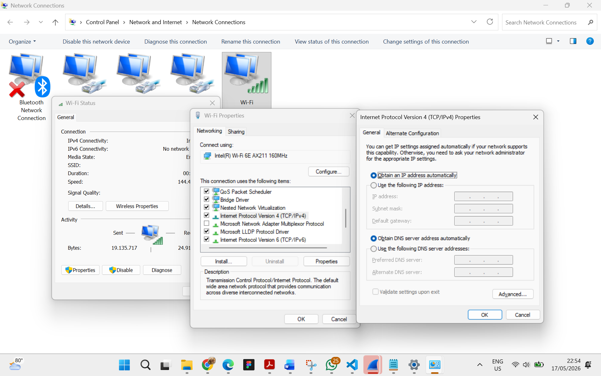
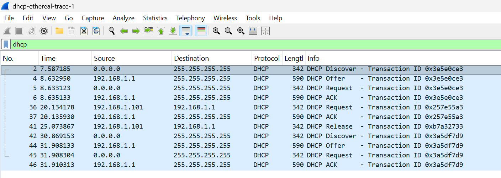

### **Difa Auliya Andini Putri - 103072400112**

# **Laporan Praktikum Modul 11: DHCP**

### **Tujuan Praktikum**
Mahasiswa menginvestigasi cara kerja protokol DHCP menggunakan Wireshark.

### **Apa itu DHCP?**
Dynamic Host Configuration Protocol (DHCP) adalah sebuah protokol manajemen jaringan dengan arsitektur client server yang berfungsi untuk mendistribusikan konfigurasi jaringan secara otomatis. Melalui DHCP, proses dilakukan secara otomatis dengan sistem penyewaan (lease). Server DHCP memiliki kumpulan alamat IP (IP pool) yang akan dipinjamkan kepada klien untuk jangka waktu tertentu. Ketika masa sewa tersebut habis, klien dapat memperbaruinya, atau alamat IP tersebut akan ditarik kembali oleh server untuk diberikan kepada perangkat lain, ini sangat meningkatkan efisiensi pengelolaan jaringan dan mencegah terjadinya tabrakan alamat IP (IP conflict).

Untuk memastikan perangkat menggunakan DHCP dan bukan konfigurasi IP statis, pengaturan dapat diperiksa melalui Network Properties pada Windows dengan membuka Network Connections → Wi-Fi Properties → Internet Protocol Version 4 (TCP/IPv4) → Properties. 

 
Pada pengaturan tersebut, terlihat bahwa opsi Obtain an IP address automatically dan Obtain DNS server address automatically dalam keadaan aktif. Hal ini menunjukkan bahwa komputer dikonfigurasi sebagai DHCP Client, sehingga setiap kali perangkat terhubung ke jaringan, sistem akan secara otomatis meminta alamat IP serta konfigurasi jaringan lainnya seperti DNS Server dari DHCP Server.

Konfigurasi ini memudahkan pengguna karena tidak perlu memasukkan IP Address, Subnet Mask, Gateway, maupun DNS secara manual. Selain itu, penggunaan DHCP juga membantu mengurangi risiko kesalahan konfigurasi dan konflik IP Address dalam jaringan. Dengan demikian, perangkat dapat terhubung ke jaringan dengan lebih cepat, efisien, dan sesuai dengan pengaturan server yang tersedia.

### **Kelebihan dan Kekurangan DHCP**
**Kelebihan:** 
DHCP mempermudah pengelolaan jaringan karena proses pemberian IP Address dan konfigurasi jaringan dilakukan secara otomatis tanpa harus diatur manual satu per satu. Hal ini sangat efisien terutama pada jaringan besar dengan banyak perangkat, menghemat waktu administrator, mengurangi human error, serta mencegah terjadinya konflik IP Address antar perangkat. DHCP juga memudahkan perangkat baru untuk langsung terhubung ke jaringan dengan cepat.

**Kekurangan:** 
DHCP sangat bergantung pada DHCP Server. Jika server mengalami gangguan atau mati, perangkat baru tidak dapat memperoleh alamat IP sehingga kesulitan terhubung ke jaringan. Selain itu, alamat IP yang diberikan dapat berubah sesuai lease time sehingga kurang cocok untuk perangkat yang membutuhkan IP tetap seperti server tertentu. Dari sisi keamanan, DHCP juga berisiko jika terdapat DHCP server palsu (rogue DHCP) yang dapat memberikan konfigurasi jaringan yang salah kepada client.

### **DORA**
DORA adalah proses utama dalam DHCP yang digunakan agar perangkat client dapat memperoleh alamat IP secara otomatis dari DHCP server. Berdasarkan hasil pengamatan pada Wireshark (dhcp-ethereal-trace-1), terlihat bahwa proses DHCP berlangsung melalui empat tahap utama, yaitu Discover, Offer, Request, dan Acknowledgement dengan Transaction ID yang sama pada setiap rangkaian proses, menandakan bahwa paket-paket tersebut merupakan satu sesi komunikasi DHCP.

 

**Discover:** 
Tahap pertama terjadi ketika client yang belum memiliki alamat IP mengirimkan paket DHCP Discover dari alamat sumber 0.0.0.0 ke alamat tujuan 255.255.255.255 (broadcast) untuk mencari DHCP server yang tersedia. Pada capture Wireshark terlihat paket Discover dengan Transaction ID 0x3e5e0ce3.

**Offer:** 
Setelah menerima Discover, DHCP server dengan alamat 192.168.1.1 merespons melalui paket DHCP Offer ke broadcast dengan menawarkan alamat IP kepada client. Pada trace, Offer juga menggunakan Transaction ID 0x3e5e0ce3, menunjukkan balasan untuk permintaan client tersebut.

**Request:** 
Client kemudian mengirimkan DHCP Request untuk meminta penggunaan alamat IP yang ditawarkan server. Paket ini juga dikirim secara broadcast agar semua DHCP server mengetahui pilihan client.

**Acknowledgement (ACK)**: 
Tahap terakhir adalah DHCP ACK, yaitu server mengonfirmasi bahwa alamat IP resmi diberikan kepada client. Setelah ACK diterima, client dapat menggunakan konfigurasi jaringan tersebut untuk terhubung ke jaringan.

Melalui proses DORA, DHCP memungkinkan konfigurasi jaringan dilakukan secara otomatis, cepat, dan efisien tanpa perlu pengaturan manual.