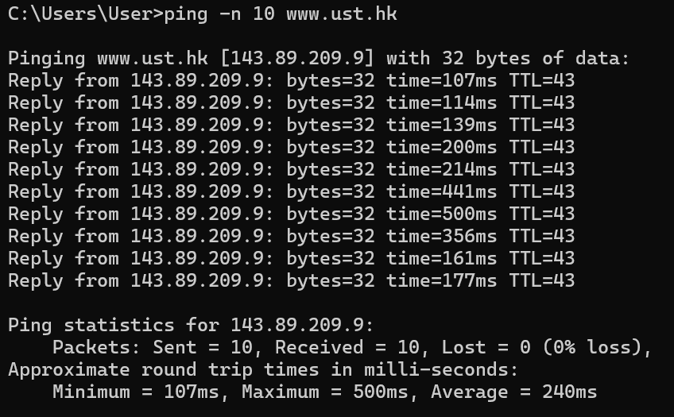
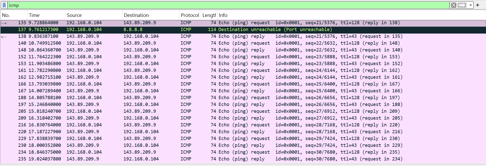
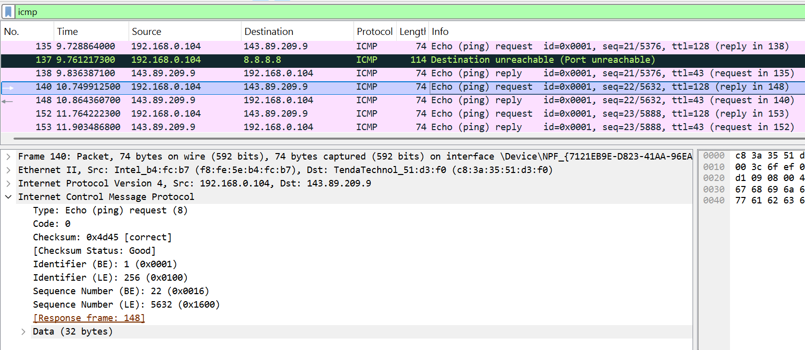
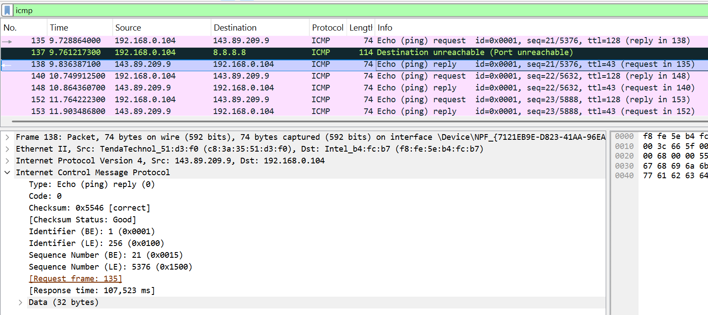
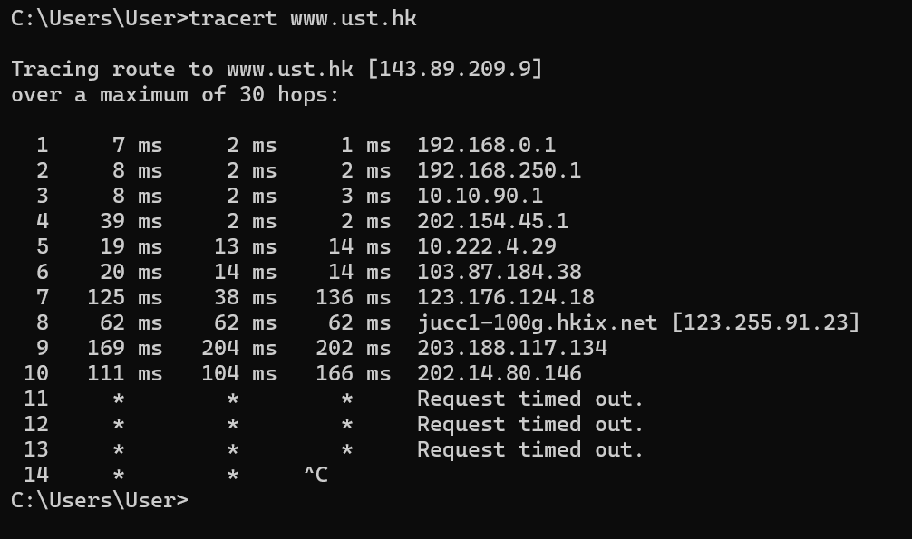
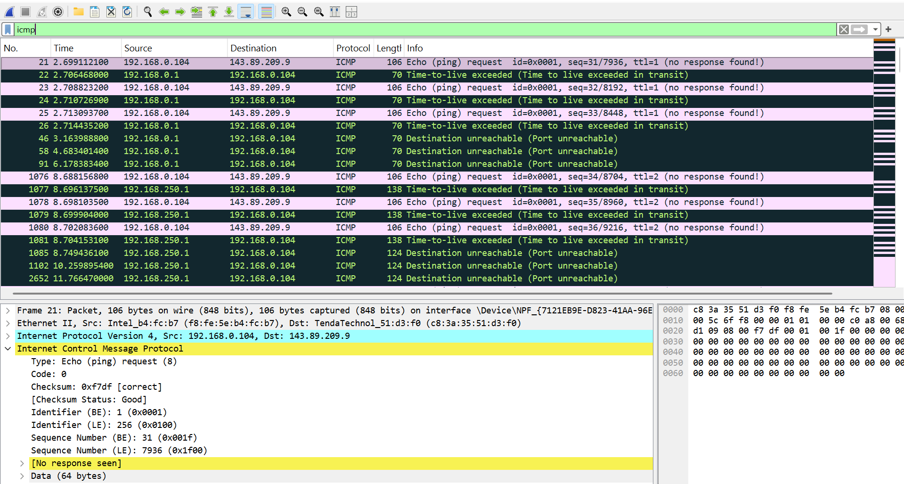
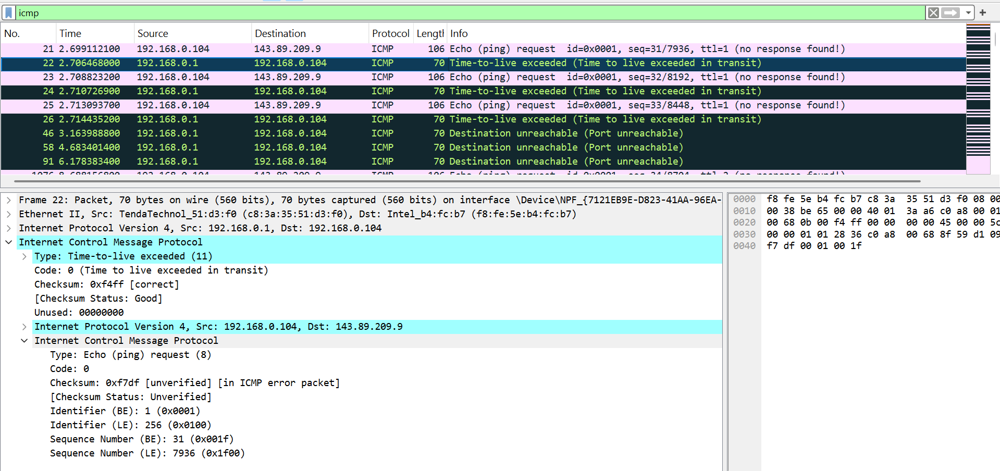

### **Difa Auliya Andini Putri - 103072400112**

# **Laporan Praktikum Modul 12: ICMP**

### **Tujuan Praktikum**
1. Mahasiswa dapat menginvestigasi cara kerja protokol ICMP menggunakan Wireshark 
2. Mahasiswa dapat membuat program ICMP Pinger 

### **ICMP (Internet Control Message Protocol)**

ICMP (Internet Control Message Protocol) adalah protokol yang digunakan untuk mengirim pesan kontrol dan diagnosis pada jaringan komputer. ICMP membantu perangkat jaringan untuk mengetahui kondisi komunikasi, apakah host tujuan dapat dihubungi, apakah terjadi error, atau jalur paket mengalami masalah.

ICMP memiliki beberapa fungsi utama, yaitu:
- Mendiagnosis kondisi jaringan
- Mengecek apakah host dalam jaringan dapat dihubungi
- Mengetahui jalur atau hop yang dilewati paket
- Memberikan informasi error pada komunikasi jaringan

ICMP sering digunakan pada beberapa perintah jaringan seperti:
- ping → untuk mengecek konektivitas host
- tracert/traceroute → untuk mengetahui jalur paket menuju tujuan

Hubungan antara IP dan ICMP adalah ICMP berjalan di atas protokol IP. Paket IP digunakan sebagai media pengiriman data, sedangkan pesan ICMP berada pada bagian payload dari paket IP tersebut. Karena itu, ICMP tidak bekerja sendiri melainkan dibawa oleh paket IP selama proses transmisi data.

Pada Wireshark, isi paket ICMP dapat dianalisis melalui beberapa field penting, yaitu:

1. Type
Menunjukkan jenis pesan ICMP yang dikirim.
Contoh:
- Type 8 → Echo Request
- Type 0 → Echo Reply
- Type 11 → Time Exceeded (TTL Exceeded)
2. Code : Berisi detail tambahan dari type ICMP. Nilai code membantu menjelaskan kondisi spesifik dari pesan ICMP tersebut.
3. Checksum : Digunakan untuk mengecek apakah paket mengalami kerusakan/error selama proses transmisi.
4. Identifier : Berfungsi sebagai penanda paket ICMP agar request dan reply dapat dikenali sebagai pasangan komunikasi yang sama.
5. Sequence Number : Menunjukkan urutan paket ICMP yang dikirim sehingga paket dapat dicocokkan dan dianalisis berdasarkan urutannya.
 

### **PRAKTIKUM**
**Analisis Pesan ICMP yang dihasilkan oleh program Ping**

1. Buka Wireshark dan memulai capture jaringan.
2. Buka Command Prompt (CMD)
3. Jalankan perintah:
`ping -n 10 www.ust.hk` 
 
Seluruh paket yang dikirim berhasil diterima kembali tanpa kehilangan paket.
 
Hasil ping menunjukkan bahwa komputer berhasil mengirimkan 10 paket ICMP Echo Request ke server www.ust.hk dengan alamat IP 143.89.209.9 dan seluruh paket mendapatkan balasan Echo Reply tanpa packet loss. Nilai RTT (Round Trip Time) bervariasi antara 107 ms hingga 500 ms dengan rata-rata 240 ms. Nilai TTL pada balasan sebesar 43, yang menunjukkan paket telah melewati beberapa router sebelum sampai ke tujuan.

4. Kembali ke wireshark, hentikan capture lalu filter dengan 'icmp' 
 
Berdasarkan hasil capture terlihat pasangan paket ICMP secara bergantian, yaitu paket Echo Request dari 192.168.0.104 menuju 143.89.209.9 dan paket Echo Reply dari server menuju komputer pengguna. Jumlah paket yang terlihat adalah 20 paket, terdiri dari 10 request dan 10 reply. Setiap pasangan paket memiliki sequence number yang sama untuk mencocokkan request dan reply, misalnya paket request dengan sequence 22/5632 mendapatkan balasan reply dengan sequence yang sama.

5. Mengamati Paket ICMP Echo Request & Echo Reply. 

**ICMP Echo Request:**
 
Berdasarkan hasil capture Wireshark pada paket request:
- Type = 8 → menunjukkan ICMP Echo Request
- Code = 0 → tidak ada informasi error tambahan
- Checksum = 0x4d45 [correct] → paket tidak mengalami error
- Identifier = 0x0001 → penanda paket ICMP
- Sequence Number = 22 → urutan paket ping yang dikirim

Paket dikirim dari 192.168.0.104 menuju 143.89.209.9 dan memiliki TTL 128.

**ICMP Echo Reply:**
 
Berdasarkan hasil capture Wireshark pada paket reply:
- Type = 0 → menunjukkan ICMP Echo Reply
- Code = 0 → balasan normal tanpa error
- Checksum = 0x5546 [correct] → paket diterima dengan baik
- Identifier = 0x0001 → sama dengan paket request
- Sequence Number = 21 → sesuai dengan urutan paket request sebelumnya

Paket dikirim dari 143.89.209.9 menuju 192.168.0.104 dengan TTL 43, yang menunjukkan paket telah melewati beberapa hop sebelum sampai ke tujuan.

**Analisis Pesan ICMP yang dihasilkan oleh program Traceroute**
1. Buka Wireshark dan memulai capture jaringan.
2. Buka Command Prompt (CMD)
3. Jalankan perintah:
`tracert www.ust.hk` 
 

4. Kembali ke wireshark, hentikan capture lalu filter dengan 'icmp' 
 
Setelah dilakukan filter `icmp` pada Wireshark, terlihat beberapa jenis pesan ICMP yang muncul selama proses traceroute berlangsung, yaitu Echo Request, Time-to-live exceeded, dan Destination unreachable. Paket Echo Request dikirim dari komputer `192.168.0.104` menuju host tujuan `143.89.209.9` dengan nilai TTL tertentu. Ketika nilai TTL habis di tengah perjalanan, router yang dilewati akan mengirim balasan berupa pesan **Time-to-live exceeded** kepada pengirim.
Pada capture terlihat bahwa saat paket dikirim dengan `ttl=1`, balasan TTL Exceeded berasal dari router `192.168.0.1`. Setelah nilai TTL dinaikkan menjadi `ttl=2`, balasan berasal dari router berikutnya yaitu `192.168.250.1`. Hal ini menunjukkan bahwa traceroute memanfaatkan mekanisme TTL untuk mengetahui jalur atau hop yang dilewati paket sebelum mencapai tujuan. Selain itu juga terlihat beberapa pesan **Destination unreachable** yang menandakan paket tidak dapat diteruskan menuju tujuan tertentu.

5. Pilih paket ICMP TTL Exceeded
 
Berdasarkan hasil analisis paket **Time-to-live exceeded** pada Wireshark, terlihat bahwa router `192.168.0.1` mengirim pesan ICMP kepada komputer `192.168.0.104` karena nilai TTL paket telah habis sebelum mencapai tujuan `143.89.209.9`. Pada bagian ICMP terlihat informasi:

-  **Type = 11** → menunjukkan pesan *Time-to-live exceeded*.
- **Code = 0** → TTL habis saat paket masih dalam proses perjalanan (**Time to live exceeded in transit**).
- **Checksum = 0xf4ff [correct]** → paket diterima tanpa error.
- **Identifier = 0x0001** → penanda paket ICMP.
- **Sequence Number = 31** → menunjukkan urutan paket yang menyebabkan TTL habis. 
Di dalam paket TTL Exceeded juga terdapat salinan paket asli berupa **Echo Request (Type 8)** yang sebelumnya dikirim dari `192.168.0.104` menuju `143.89.209.9`. Hal ini digunakan router untuk memberi tahu paket mana yang gagal diteruskan karena nilai TTL sudah mencapai 0.

