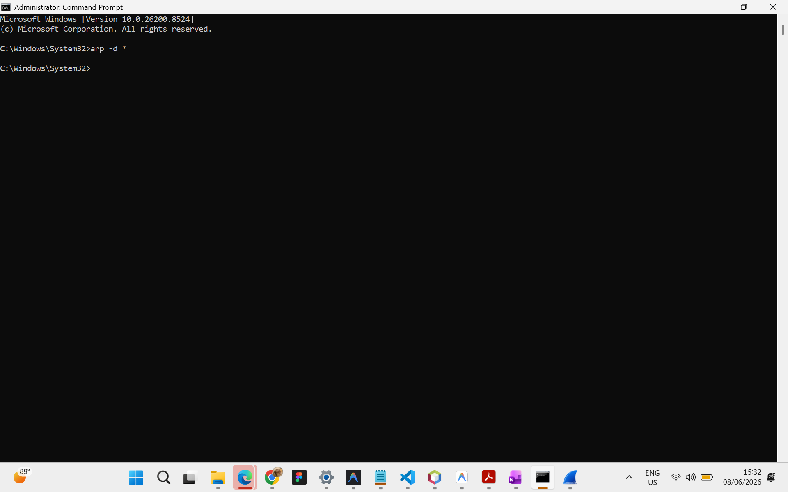
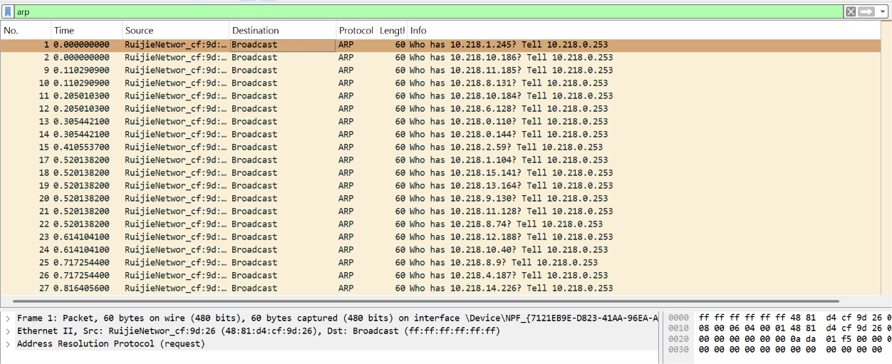
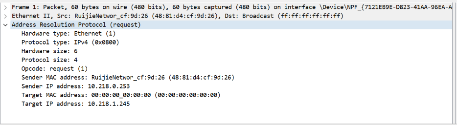

### **Difa Auliya Andini Putri - 103072400112**

# **Laporan Praktikum Modul 13: Ethernet dan ARP**

### **Tujuan Praktikum**
1. Mahasiswa dapat menginvestigasi cara kerja Ethernet menggunakan Wireshark.
2. Mahasiswa dapat menginvestigasi cara kerja Address Resolution Protocol (ARP) menggunakan Wireshark.

### **PRAKTIKUM**

## **Analisis Address Resolution Protocol (ARP)**

### **1. Menghapus ARP Cache**

Sebelum melakukan pengamatan terhadap protokol ARP, cache ARP perlu dikosongkan terlebih dahulu agar komputer kembali melakukan proses pencarian alamat MAC melalui ARP Request dan ARP Reply.

Perintah yang dijalankan pada Command Prompt:

```cmd
arp -d *
```
<br>
<br>
Perintah arp -d * digunakan untuk menghapus seluruh entri yang terdapat pada ARP cache komputer. Dengan dihapusnya cache tersebut, sistem tidak lagi memiliki informasi pasangan alamat IP dan alamat MAC yang sebelumnya tersimpan. Akibatnya, ketika komputer akan berkomunikasi dengan host lain pada jaringan lokal, komputer harus mengirimkan pesan ARP Request untuk memperoleh alamat MAC tujuan terlebih dahulu. Langkah ini dilakukan agar proses pertukaran pesan ARP dapat diamati dengan jelas melalui Wireshark.

### **Mengamati Aksi ARP**

1. Setelah cache ARP dikosongkan, jalankan Wireshark dan mulai proses capture paket.

2. Buka browser kemudian akses URL:

`http://gaia.cs.umass.edu/wireshark-labs/HTTP-wireshark-lab-file3.html`

<br>
<br>

Halaman web berhasil diakses dan menampilkan dokumen Bill of Rights. Pada tahap ini komputer perlu mengetahui alamat MAC dari perangkat tujuan (gateway) sebelum dapat mengirim paket HTTP. Karena cache ARP sebelumnya telah dikosongkan, maka komputer akan melakukan proses ARP terlebih dahulu untuk memperoleh alamat fisik yang diperlukan.

3. Kembali ke Wireshark lalu hentikan proses capture lalu filter 'arp'

<br>
<br>
<br>

### **Analisis Paket ARP Request**

Berdasarkan hasil capture Wireshark pada paket ARP Request, terlihat bahwa perangkat dengan alamat IP `10.218.0.253` sedang mencari alamat MAC dari host yang memiliki alamat IP `10.218.1.245`. Karena alamat MAC tujuan belum diketahui, paket ARP dikirim menggunakan alamat broadcast sehingga dapat diterima oleh seluruh perangkat dalam jaringan lokal.

Informasi penting yang terdapat pada paket ARP Request adalah sebagai berikut:

- **Hardware Type = Ethernet (1)** → menunjukkan bahwa ARP digunakan pada jaringan Ethernet.
- **Protocol Type = IPv4 (0x0800)** → menunjukkan bahwa alamat yang dipetakan adalah alamat IPv4.
- **Hardware Size = 6** → panjang alamat MAC adalah 6 byte.
- **Protocol Size = 4** → panjang alamat IPv4 adalah 4 byte.
- **Opcode = Request (1)** → menunjukkan bahwa paket merupakan permintaan pencarian alamat MAC.
- **Sender MAC Address = 48:81:d4:cf:9d:26** → alamat MAC perangkat pengirim.
- **Sender IP Address = 10.218.0.253** → alamat IP perangkat pengirim.
- **Target MAC Address = 00:00:00:00:00:00** → alamat MAC tujuan belum diketahui.
- **Target IP Address = 10.218.1.245** → alamat IP yang sedang dicari alamat MAC-nya.

Paket ARP Request ini dikirim ke alamat broadcast `ff:ff:ff:ff:ff:ff` sehingga seluruh host dalam jaringan menerima permintaan tersebut. Jika terdapat host dengan alamat IP `10.218.1.245`, maka host tersebut akan mengirimkan ARP Reply yang berisi alamat MAC miliknya kepada pengirim.

