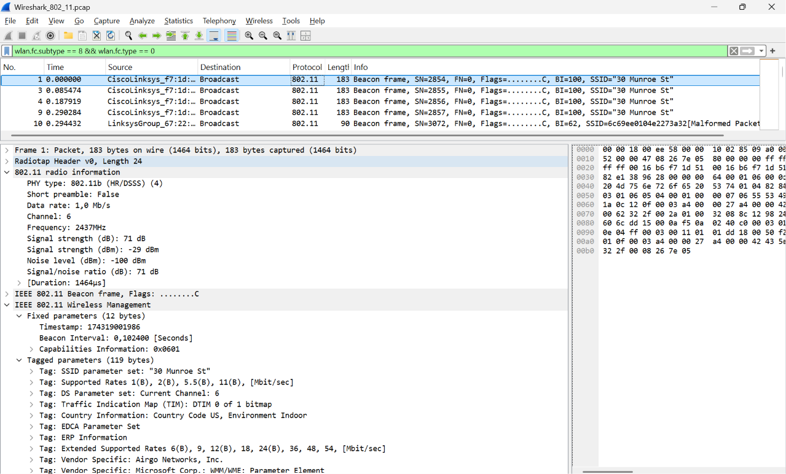
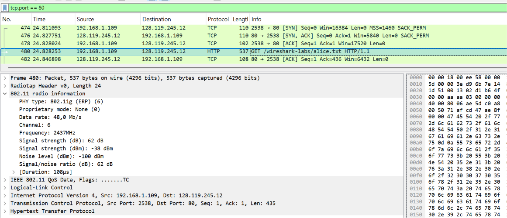
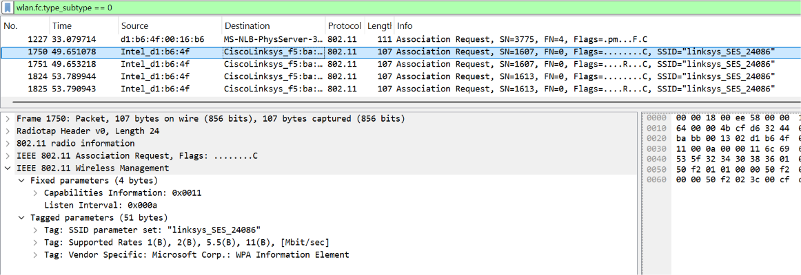
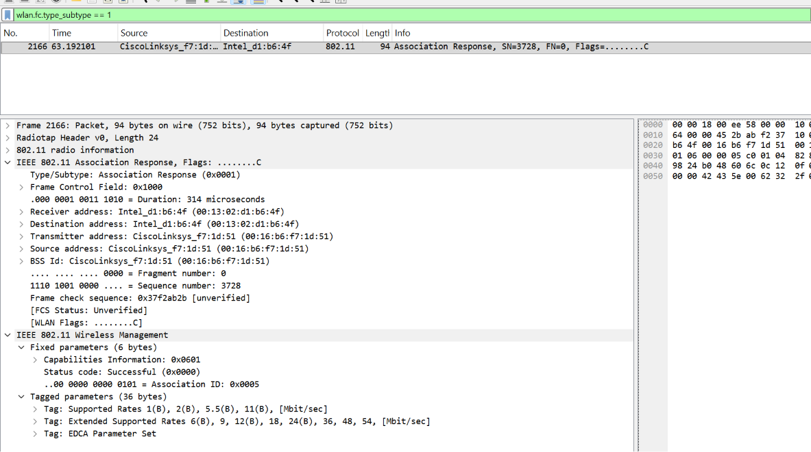
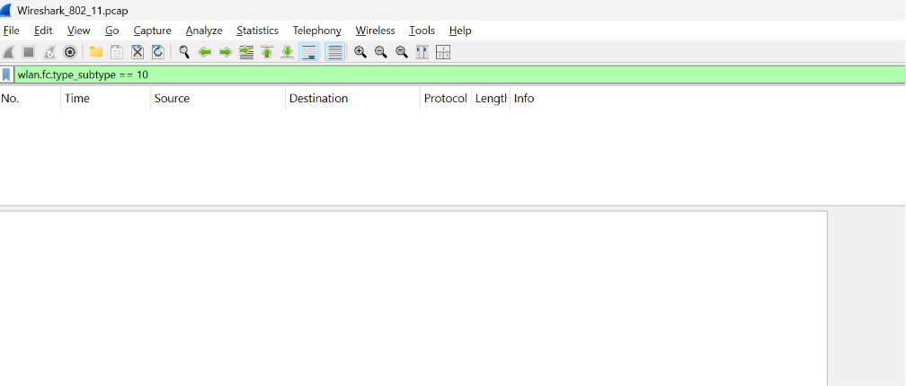

### **Difa Auliya Andini Putri - 103072400112**

# **Laporan Praktikum Modul 14: 802.11 WiFi**

### Tujuan Praktikum
1. Mahasiswa dapat menginvestigasi cara kerja WiFi menggunakan Wireshark.

### **802.11 WiFi**

IEEE 802.11 merupakan standar komunikasi jaringan nirkabel (Wireless LAN/WLAN) yang memungkinkan perangkat berkomunikasi tanpa menggunakan media kabel. Pada jaringan WiFi, pertukaran data dilakukan melalui gelombang radio antara perangkat pengguna (station/client) dan Access Point (AP).

Berbeda dengan Ethernet yang menggunakan kabel sebagai media transmisi, jaringan 802.11 menggunakan frame khusus yang membawa berbagai informasi seperti identitas Access Point, proses autentikasi, asosiasi, manajemen koneksi, serta transfer data.

Beberapa jenis frame yang digunakan pada protokol 802.11 antara lain:

1. **Management Frame**
   Digunakan untuk membangun dan mengelola koneksi antara client dan Access Point. Contohnya Beacon Frame, Probe Request, Probe Response, Association Request, dan Association Response.

2. **Control Frame**
   Digunakan untuk mengatur akses media dan meningkatkan keandalan komunikasi, seperti ACK (Acknowledgement), RTS (Request To Send), dan CTS (Clear To Send).

3. **Data Frame**
   Digunakan untuk mengirimkan data pengguna, misalnya paket HTTP, DNS, atau protokol lainnya yang melewati jaringan WiFi.

Pada praktikum ini dilakukan analisis terhadap file capture Wireshark_802_11.pcap untuk mengamati cara kerja protokol 802.11, khususnya Beacon Frame, proses transfer data, serta mekanisme association dan disassociation antara client dengan Access Point.

### PRAKTIKUM

### **Analisis Beacon Frame**

1. Buka file `Wireshark_802_11.pcap` pada Wireshark.
2. Gunakan filter:
`wlan.fc.subtype == 8 && wlan.fc.type == 0`

3. Amati salah satu Beacon Frame yang muncul.

 

Beacon Frame merupakan management frame yang digunakan untuk mengumumkan keberadaan Access Point kepada perangkat di sekitarnya.

Pada capture terlihat Access Point dengan SSID **"30 Munroe St"** secara periodik mengirimkan Beacon Frame ke alamat broadcast sehingga seluruh perangkat pada area cakupan jaringan dapat mendeteksi keberadaan jaringan tersebut.

Berdasarkan hasil analisis paket Beacon Frame diperoleh informasi sebagai berikut:

- **SSID = "30 Munroe St"** → nama jaringan WiFi yang diumumkan oleh Access Point.
- **Beacon Interval = 0.102400 second** → Access Point mengirim Beacon Frame setiap sekitar 102,4 ms.
- **Channel = 6 (2437 MHz)** → jaringan beroperasi pada channel 6 dengan frekuensi 2437 MHz.
- **PHY Type = 802.11b** → standar fisik yang digunakan pada frame beacon yang ditangkap.
- **Data Rate = 1 Mbps** → kecepatan transmisi Beacon Frame.
- **Signal Strength = -29 dBm** → menunjukkan sinyal yang diterima cukup kuat.
- **Supported Rates = 1, 2, 5.5, dan 11 Mbps** → kecepatan data yang didukung Access Point.
- **Extended Supported Rates = 6, 9, 12, 18, 24, 36, 48, dan 54 Mbps** → kecepatan tambahan yang juga didukung.

Informasi tersebut digunakan oleh perangkat client untuk menentukan karakteristik jaringan sebelum melakukan proses koneksi ke Access Point.

### **Analisis Data Transfer**

1. Gunakan filter: `tcp.port == 80`

2. Amati paket yang berkaitan dengan komunikasi HTTP.

 

Pada hasil capture terlihat komunikasi antara host `192.168.1.109` dan server `128.119.245.12` menggunakan protokol HTTP melalui port 80. Paket yang diamati merupakan Data Frame 802.11 yang membawa data TCP dan HTTP.

Berdasarkan hasil analisis Frame 480 diperoleh informasi:

- **Frame Type = QoS Data** → frame digunakan untuk mentransmisikan data pengguna pada jaringan WiFi.
- **PHY Type = 802.11g** → menggunakan standar 802.11g.
- **Data Rate = 48 Mbps** → kecepatan transmisi frame.
- **Channel = 6 (2437 MHz)** → menggunakan channel yang sama dengan Access Point.
- **Source IP = 192.168.1.109** → alamat IP client.
- **Destination IP = 128.119.245.12** → alamat IP server tujuan.
- **Source Port = 2538**
- **Destination Port = 80 (HTTP)**
- **TCP Payload Length = 435 byte**

Frame ini menunjukkan proses pengiriman data HTTP dari client menuju server melalui jaringan WiFi setelah client berhasil terhubung ke Access Point.

### **Analisis Association Request**

1. Gunakan filter:`wlan.fc.type_subtype == 0`

2. Pilih salah satu paket Association Request.

 

Association Request merupakan management frame yang dikirim oleh client kepada Access Point ketika client ingin bergabung ke suatu jaringan WiFi.

Berdasarkan hasil analisis paket Association Request diperoleh informasi:

- **Frame Type = Association Request**
- **SSID = "linksys_SES_24086"** → jaringan yang ingin diakses client.
- **Capabilities Information = 0x0011** → informasi kemampuan perangkat yang digunakan saat proses asosiasi.
- **Listen Interval = 0x000a** → interval client dalam mendengarkan beacon dari Access Point.
- **Supported Rates = 1, 2, 5.5, dan 11 Mbps**
- **Vendor Specific = Microsoft WPA Information Element** → menunjukkan dukungan terhadap mekanisme keamanan WPA.

Frame ini menunjukkan bahwa client mencoba melakukan asosiasi dengan Access Point bernama **linksys_SES_24086**.

### **Analisis Association Response**

1. Gunakan filter:`wlan.fc.type_subtype == 1`

2. Pilih paket Association Response.

 

Association Response merupakan balasan dari Access Point terhadap permintaan asosiasi yang dikirim oleh client.

Berdasarkan hasil analisis paket Association Response diperoleh informasi:

- **Frame Type = Association Response**
- **Source Address = CiscoLinksys_f7:1d:51**
- **Destination Address = Intel_d1:b6:4f**
- **Status Code = Successful (0x0000)** → proses asosiasi berhasil.
- **Association ID = 0x0005** → identitas yang diberikan Access Point kepada client.
- **Capabilities Information = 0x0601**
- **Supported Rates = 1, 2, 5.5, dan 11 Mbps**
- **Extended Supported Rates = 6, 9, 12, 18, 24, 36, 48, dan 54 Mbps**

Hasil ini menunjukkan bahwa client berhasil melakukan asosiasi dengan Access Point dan telah memperoleh Association ID sehingga dapat melanjutkan komunikasi data melalui jaringan WiFi.

### **Analisis Disassociation**

1. Gunakan filter:`wlan.fc.type_subtype == 10`

2. Amati paket yang muncul.

 

Filter `wlan.fc.type_subtype == 10` digunakan untuk menampilkan frame **Disassociation** pada protokol IEEE 802.11. Frame ini termasuk ke dalam management frame yang berfungsi untuk mengakhiri hubungan asosiasi antara client dan Access Point.

Berdasarkan hasil filtering pada file capture `Wireshark_802_11.pcap`, tidak ditemukan paket Disassociation yang sesuai dengan filter tersebut. Hal ini menunjukkan bahwa selama proses perekaman lalu lintas jaringan tidak terdapat frame Disassociation yang berhasil ditangkap oleh Wireshark.

Walaupun tidak ditemukan pada capture, frame Disassociation tetap memiliki peran penting dalam jaringan WiFi. Frame ini digunakan ketika client atau Access Point ingin mengakhiri hubungan asosiasi yang sedang berlangsung sehingga komunikasi melalui koneksi tersebut tidak dapat dilanjutkan sampai proses asosiasi dilakukan kembali.