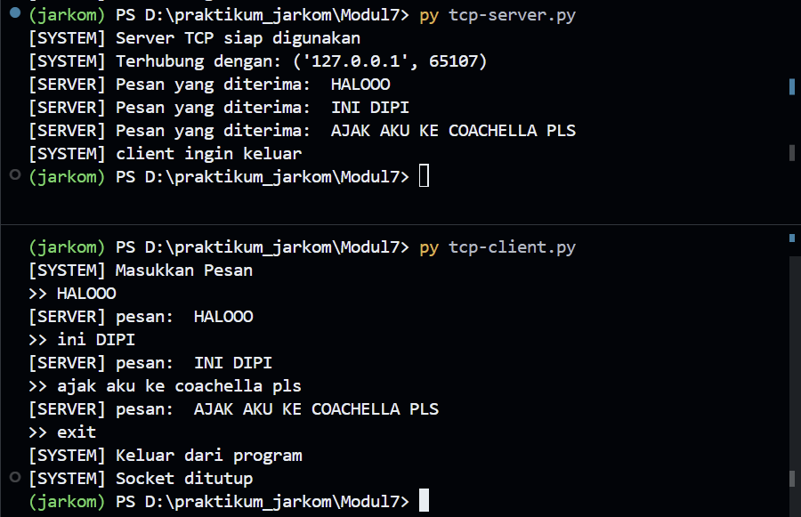
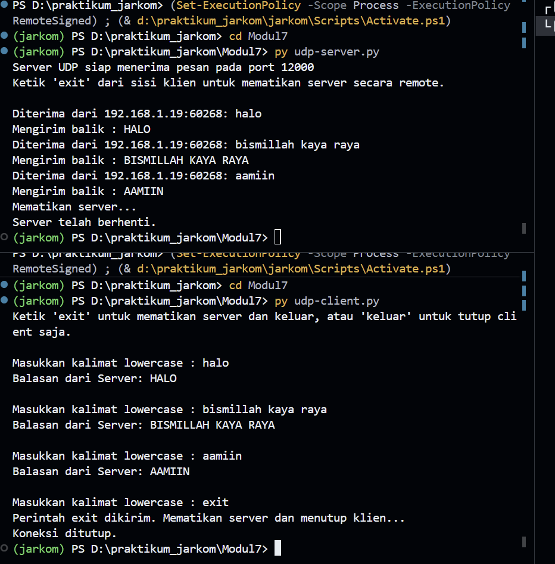

### **Difa Auliya Andini Putri - 103072400112**

# **Laporan Praktikum Modul 7: Socket Programming**

### **Tujuan Praktikum**
1. Mampu membuat program berbasis socket UDP
2. Mampu membuat program berbasis socket TCP

### **Program Socket dengan TCP**
TCP adalah protokol berorientasi koneksi. Ini berarti bahwa sebelum klien dan
server dapat mulai mengirim data satu sama lain, mereka harus terlebih dahulu handshake dan
membuat koneksi TCP. Salah satu ujung koneksi TCP terpasang ke soket klien dan ujung lainnya
terpasang ke soket server. Saat membuat koneksi TCP, kita mengaitkannya dengan alamat soket
klien (alamat IP dan nomor port) dan alamat soket server (alamat IP dan nomor port). TCP memastikan data terkirim dengan benar (reliable), tidak hilang, berurutan. Sebelum komunikasi, TCP melakukan proses Three-way handshake (SYN, SYN-ACK, ACK).

**TCP Client:**
```python
from socket import *

serverName = "localhost"
serverPort = 12000 

#AF inet itu ipv4, | SOCK_STREAM itu TCP
clientSocket = socket(AF_INET, SOCK_STREAM)

#hubungan | connect
clientSocket.connect(
    (serverName, serverPort)
)

print("[SYSTEM] Masukkan Pesan")

running = True
while running:
    #input
    message = input(">> ")

    #kirim ke server
    #encode = abcdef = 1010100110
    clientSocket.send(message.encode())
    
    #kalo exit = socket tutup
    if message == "exit":
        print("[SYSTEM] Keluar dari program")
        running = False
        break

    #menerima pesan dari server
    modifiedMessage = clientSocket.recv(2048) #abc = 01100110010101, diset max bytenya 2048
    print("[SERVER] pesan: ", modifiedMessage.decode())

#tutup socket yang tidak dipakai
clientSocket.close()
print("[SYSTEM] Socket ditutup")  
```
**Penjelasan Kode TCP Client:**
1. **socket(AF_INET, SOCK_STREAM)** → Membuat socket TCP berbasis IPv4
2. **connect((serverName, serverPort))** → Menghubungkan client ke server
3. **input()** → Mengambil pesan dari user
4. **send(message.encode())** → Mengirim pesan dalam bentuk byte
5. **recv(2048)** → Menerima balasan dari server (maks 2048 byte)
6. **decode()** → Mengubah byte menjadi string
7. **if message == "exit"** → Menghentikan program
8. **close()** → Menutup koneksi

**TCP Server:**
```python
from socket import *

serverPort = 12000
serverSocket = socket(AF_INET, SOCK_STREAM) #tcp

#meng bind server
serverSocket.bind(
    ('', serverPort)
)

#server siap menerima koneksi
serverSocket.listen(1)

print("[SYSTEM] Server TCP siap digunakan")

running = True
while running:
    #menerima koneksi dari client
    connectionSocket, addr = serverSocket.accept() ##menangkap tuple
    print("[SYSTEM] Terhubung dengan:", addr)
    
    while True:
        #pesan yang diterima = 101001
        message = connectionSocket.recv(2048).decode()

        if not message:
            break
        #cek apakah exit    
        if message.lower() == "exit":
            print("[SYSTEM] client ingin keluar")
            running = False
            break   

        #mofid capslock
        modifiedMessage = message.upper()
        print("[SERVER] Pesan yang diterima: ", modifiedMessage)

        #kirim balik ke client
        connectionSocket.send(
            modifiedMessage.encode()
        )

    connectionSocket.close()
serverSocket.close()               
```

**Penjelasan Kode TCP Server:**
1. **socket(AF_INET, SOCK_STREAM)** → Membuat socket TCP
2. **bind(('', serverPort))** → Mengikat server ke port tertentu
3. **listen(1)** → Server menunggu koneksi dari client
4. **accept()** → Menerima koneksi dari client
5. **recv(2048)** → Menerima pesan dari client
6. **decode()** → Mengubah byte menjadi string
7. **message.upper()** → Mengubah pesan menjadi huruf besar
8. **send()** → Mengirim kembali hasil ke client
9. **if message == "exit"** → Menghentikan server
10. **close()** → Menutup koneksi

**OUTPUT:**<br>
<br>

### **Program Socket dengan UDP**
UDP (User Datagram Protocol) adalah protokol transport yang bersifat connectionless, tidak memerlukan koneksi sebelum mengirim data, tidak menjamin keandalan dan urutan data, memiliki kelebihan Lebih cepat
Overhead rendah. Sebelum proses pengiriman dapat mendorong paket data keluar dari pintu soket, saat
menggunakan UDP, terlebih dahulu harus melampirkan alamat tujuan ke paket. Setelah paket
melewati soket pengirim, Internet akan menggunakan alamat tujuan ini untuk merutekan paket
melalui Internet ke soket dalam proses penerima. Ketika paket tiba di soket penerima, proses
penerima akan mengambil paket melalui soket, dan kemudian memeriksa isi paket dan mengambil
tindakan yang tepat.

**UDP Client:**
```python
from socket import *
import sys

# Konfigurasi alamat dan port server
serverName = '192.168.1.19'
serverPort = 12000

# Inisialisasi socket UDP di luar loop agar tidak dibuat berulang-ulang
clientSocket = socket(AF_INET, SOCK_DGRAM)
clientSocket.settimeout(5)  # Batas waktu tunggu 5 detik

print("Ketik 'exit' untuk mematikan server dan keluar, atau 'keluar' untuk tutup client saja.\n")

try:
    while True:
        # Input pesan dari pengguna
        message = input('Masukkan kalimat lowercase : ')
        
        # Validasi jika input kosong
        if not message:
            continue

        # Mengirim pesan ke server
        clientSocket.sendto(message.encode(), (serverName, serverPort))
        
        # Cek apakah pengguna ingin keluar
        if message.lower() == 'exit':
            print("Perintah exit dikirim. Mematikan server dan menutup klien...")
            break
        elif message.lower() == 'keluar':
            print("Menutup klien...")
            break
        
        try:
            # Menerima balasan dari server
            modifiedMessage, serverAddress = clientSocket.recvfrom(2048)
            print(f"Balasan dari Server: {modifiedMessage.decode()}\n")
        except timeout:
            print("Kesalahan : Server tidak merespons (Timeout).\n")

except Exception as e:
    print(f"Terjadi kesalahan : {e}")
finally:
    # Menutup koneksi socket secara permanen saat loop berhenti
    clientSocket.close()
    print("Koneksi ditutup.")  
```
**Penjelasan Kode UDP Client:**
1. **socket(AF_INET, SOCK_DGRAM)** → Membuat socket UDP (tanpa koneksi)
2. **settimeout(5)** → Memberi batas waktu 5 detik untuk menunggu respon server
3. **sendto(message.encode(), (serverName, serverPort))** → Mengirim data ke server tanpa koneksi
4. **recvfrom(2048)** → Menerima data + alamat server
decode() → Mengubah byte menjadi string
5. **if message == 'exit'** → Mengirim perintah untuk mematikan server
6. **elif message == 'keluar'** → Hanya menutup client
7. **except timeout** → Menangani jika server tidak merespons
8. **close()** → Menutup socket

**UDP Server:**
```python
from socket import *
import sys

# Konfigurasi server
serverPort = 12000
serverSocket = socket(AF_INET, SOCK_DGRAM)
serverSocket.bind(('', serverPort))

print(f"Server UDP siap menerima pesan pada port {serverPort}")
print("Ketik 'exit' dari sisi klien untuk mematikan server secara remote.\n")

try:
    while True:
        # Menerima pesan dari klien
        message, clientAddress = serverSocket.recvfrom(2048)
        
        # Mendekode pesan
        original_message = message.decode().strip()
        
        # Cek apakah pesan adalah perintah untuk keluar
        if original_message.lower() == 'exit':
            print(f"Mematikan server...")
            break
        
        # Mengubah pesan menjadi huruf kapital
        modifiedMessage = original_message.upper()
        
        # Menampilkan informasi klien dan isi pesan
        print(f"Diterima dari {clientAddress[0]}:{clientAddress[1]}: {original_message}")
        print(f"Mengirim balik : {modifiedMessage}")
        
        # Mengirim kembali pesan yang telah diubah ke klien
        serverSocket.sendto(modifiedMessage.encode(), clientAddress)
        
except Exception as e:
    print(f"\nTerjadi kesalahan : {e}")
finally:
    print("Server telah berhenti.")
    serverSocket.close()
    sys.exit(0)               
```

**Penjelasan Kode UDP Server:**
1. **socket(AF_INET, SOCK_DGRAM)** → Membuat socket UDP
2. **bind(('', serverPort))** → Menentukan port server
3. **recvfrom(2048)** → Menerima pesan dari client + alamat pengirim
4. **decode().strip()** → Mengubah byte ke string dan menghapus spasi
5. **if message == 'exit'** → Mematikan server dari client (remote shutdown)
6. **message.upper()** → Mengubah pesan menjadi huruf besar
7. **sendto()** → Mengirim balasan ke client
8. **close()** → Menutup socket server

**OUTPUT:**<br>
<br>