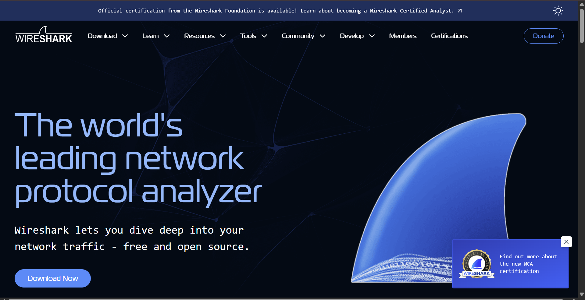
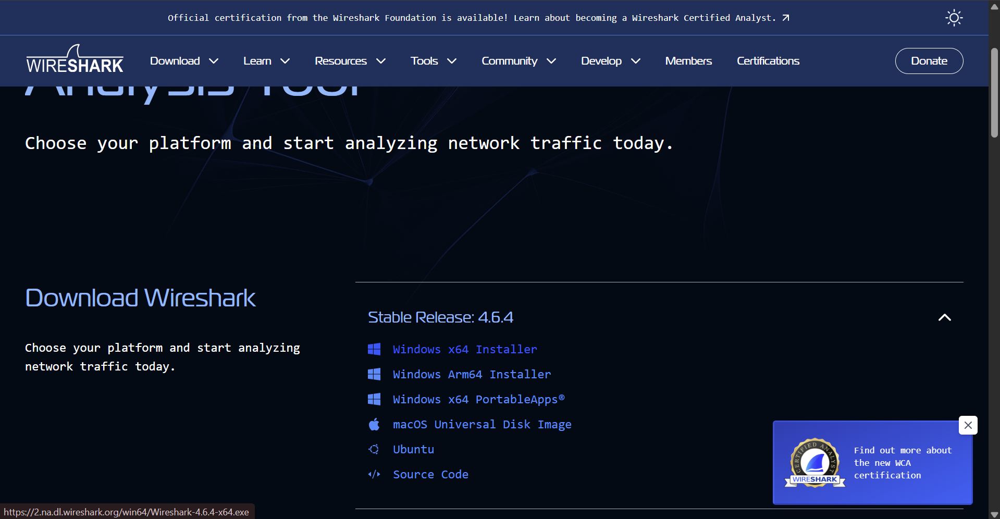
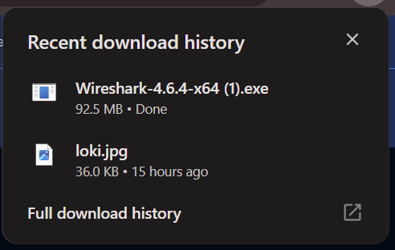
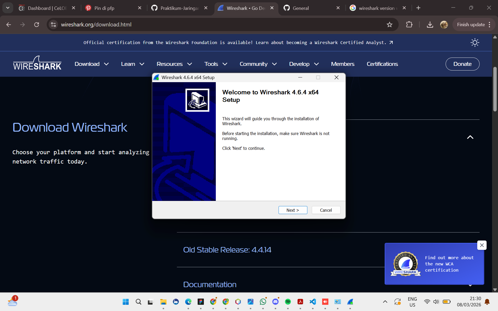
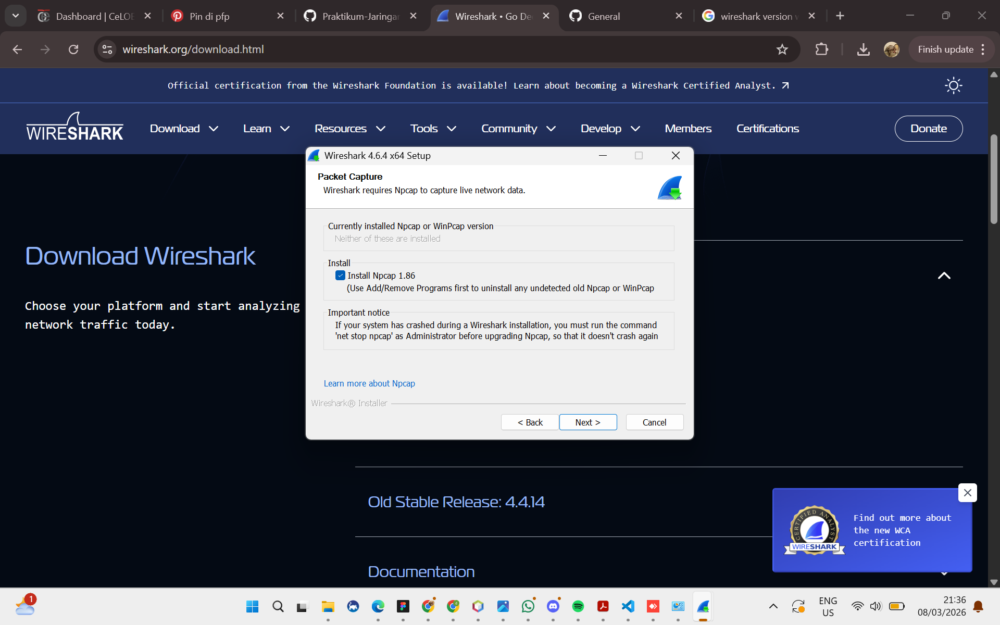
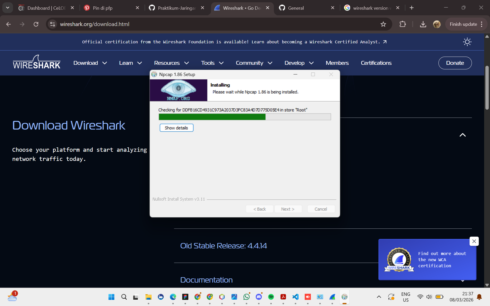
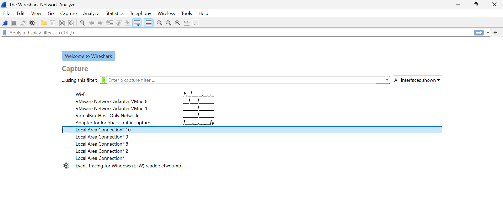
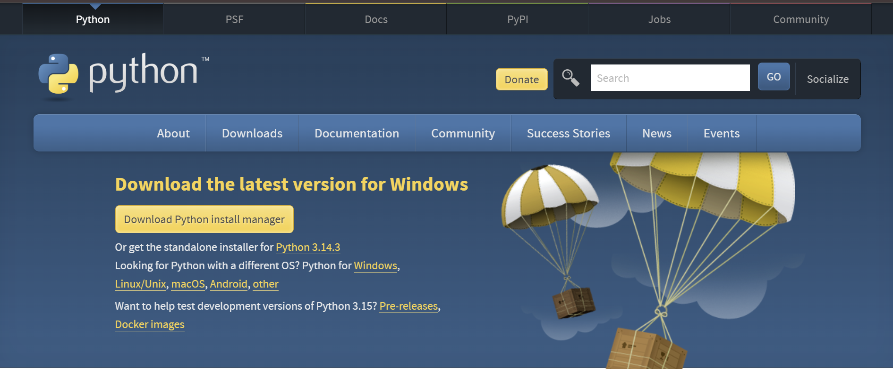
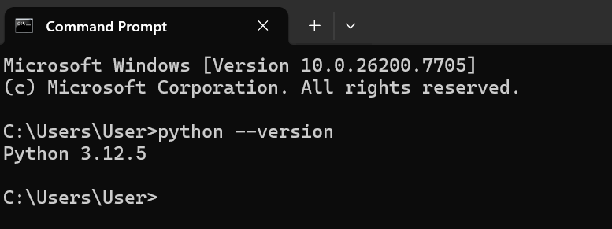

### **Difa Auliya Andini Putri - 103072400112**
# Laporan Praktikum Modul 1 (Running Modul)
### Tools yang perlu disiapkan selama praktikum :
1. **Wireshark**
2. **Python**

## **Instalasi Wireshark**
1. File installer wireshark dapat didownload pada situs resmi ini: https://www.wireshark.org/. 
Lalu install wireshark sesuai dengan sistem operasi pada laptop kita. 
 
 
 

2. Jalankan file installer wireshark yang sudah diunduh untuk memulai proses instalasi.  
Tekan tombol "Next" pada setiap tahap hingga proses pemasangan selesai. 
 

3. Di tahap ini juga dilakukan instalasi **Npcap** untuk komponen pendukung wireshark agar dapat menangkap paket data pada jaringan. 
 
 

4. Setelah instalasi selesai, aplikasi wireshark bisa dijalankan untuk memastikan program telah terpasang dengan baik. 
 

## **Instalasi Python**
1. Instalasi Python dapat didownload di https://www.python.org/downloads/. Install python sesuai dengan sistem operasi pada laptop kita, saat proses instalasi pastikan mencentang opsi"Add Python to Path" agar python dapat dijalankan lewat command prompt, Lalu ikuti alur instalasi hingga selesai. 
 

2. Setelah instalasi selesai, lakukan pengecekan melalui Command Prompt untuk memastikan Python telah terpasang dengan benar dengan Perintah "python --version" untuk menampilkan versi Python yang telah terinstal pada sistem. 
 

