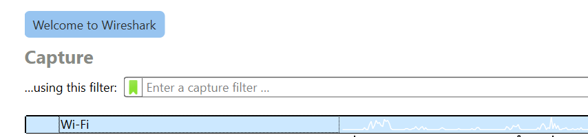
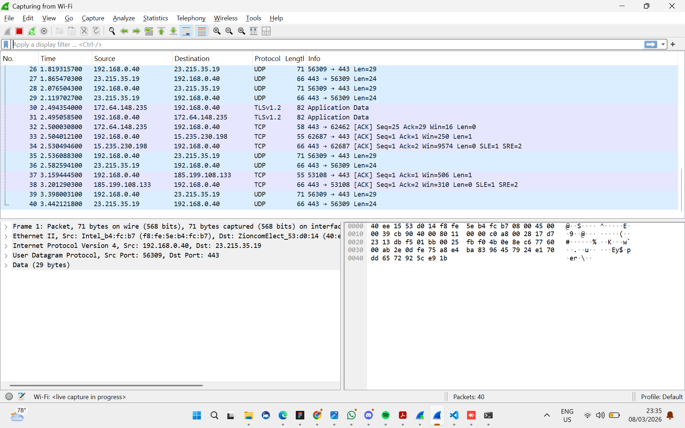
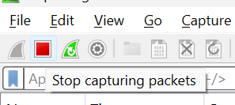
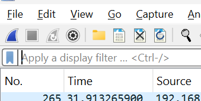
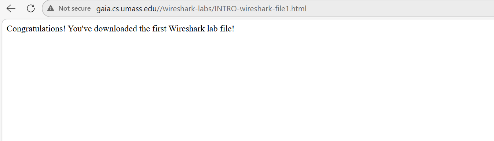
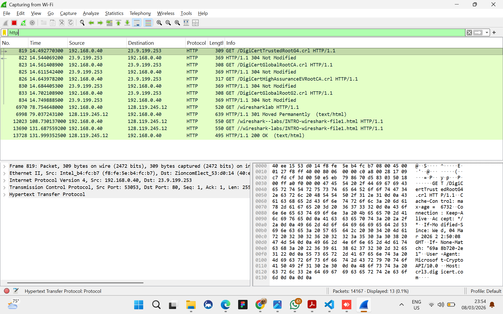
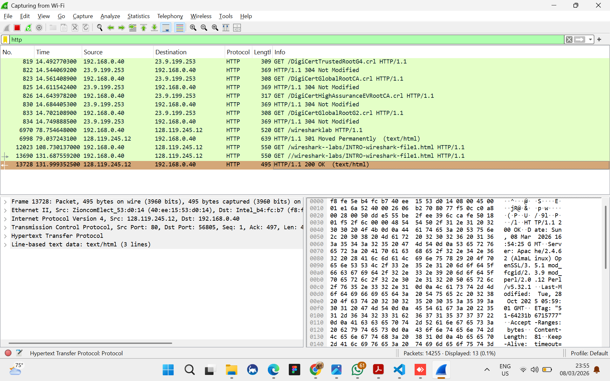
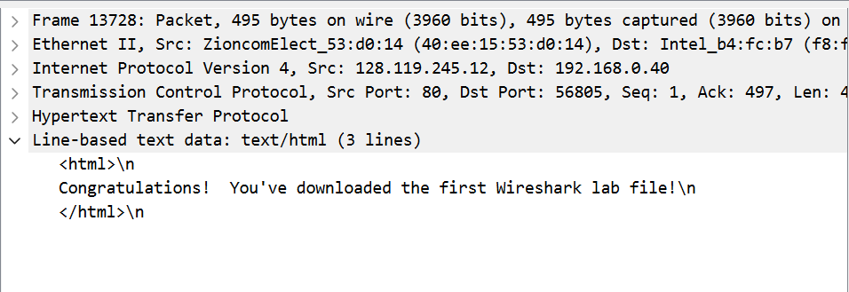

### **Difa Auliya Andini Putri - 103072400112**
# Laporan Praktikum Modul 2 (Pengenalan Tools)

## **Menjalankan Wireshark**
1. Buka aplikasi Wireshark pada komputer yang digunakan. Setelah program dijalankan, akan muncul halaman utama yang menampilkan beberapa pilihan. 
 

2. Pada halaman awal Wireshark, bagian Capture akan menampilkan beberapa daftar interface jaringan. Pilih interface “Wi-Fi” lalu klik dua kali untuk memulai proses capture paket data. 
 

3. Setelah interface dipilih, Wireshark akan langsung melakukan penangkapan paket jaringan yang melewati koneksi Wi-Fi yang sedang digunakan. 
 

4. Jika ingin menghentikan proses capture, klik ikon kotak merah (Stop Capture) yang berada di bagian atas. 
 
Untuk melanjutkan kembali proses capture, klik ikon sirip hiu Wireshark 
 

5. Untuk menghasilkan lalu lintas jaringan yang dapat ditangkap oleh Wireshark, buka browser kemudian masukkan alamat berikut: http://gaia.cs.umass.edu/wireshark-labs/INTRO-wireshark-file1.html 
 
Pastikan alamat menggunakan http. Jika browser otomatis mengubahnya menjadi https, maka halaman tidak akan menampilkan pesan “Congratulations! You've downloaded the first Wireshark lab file!”. ahapus huruf “s”. 

6. Pada kolom Display Filter, ketik http lalu tekan Enter. Wireshark akan menampilkan paket yang menggunakan protokol HTTP saja. 
 

7. Cari paket dengan informasi “**HTTP/1.1 200 OK (text/html)**” dengan ukuran data sekitar 499 bytes. 
 

8. Klik pada bagian detail protokol HTTP, akan terlihat pesan “**Congratulations! You've downloaded the first Wireshark lab file!**”, sama seperti yang muncul pada halaman browser, proses running Wireshark berhasil dan aplikasi dapat ditutup. 
 
