### **Difa Auliya Andini Putri - 103072400112**

# **Laporan Praktikum Modul 3 HTTP**

## **Tujuan Praktikum**

Dapat menginvestigasi cara kerja protokol HTTP menggunakan Wireshark.

## **Basic HTTP GET/response interaction**

1. Jalankan browser web kemudian buka Wireshark. Pada halaman utama Wireshark, pilih interface **Wi-Fi** lalu klik dua kali untuk mulai capture. Setelah itu, ketik "**http**" pada kolom display filter di bagian atas jendela Wireshark, ini untuk memastikan paket HTTP saja yang ditampilkan. 

2. Capture wireshark lau buka URL browser berikut: 
   http://gaia.cs.umass.edu/wireshark-labs/HTTPwireshark-file1.html 
   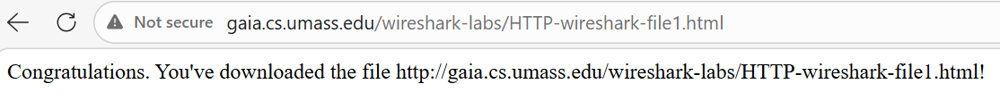 

3. Setelah halaman berhasil dimuat, kembali ke Wireshark dan klik Stop. Pada packet-listing window akan terlihat pesan HTTP yang tertangkap, HTTP GET dikirim dari browser ke server dan HTTP Response 200 OK balasan dari server yang menandakan permintaan berhasil diproses dan konten berhasil dikirimkan ke browser. 
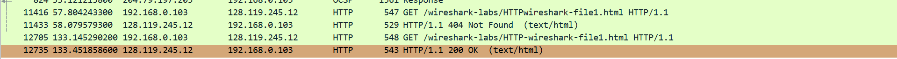 
Berikut hasil analisis paket http yng tertangkap: 
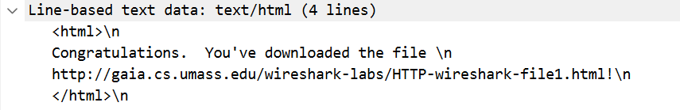 

## **HTTP CONDITIONAL GET/response interaction**

1. Pastikan cache dan history browser sudah dibersihkan terlebih dahulu agar browser tidak menggunakan data yang tersimpan dari sesi sebelumnya. 

2. Mulai capture pada Wireshark, lalu buka browser dan akses URL berikut:
http://gaia.cs.umass.edu/wireshark-labs/HTTP-wireshark-file2.html 
Berikut tampilan halaman yang berhasil dibuka: 
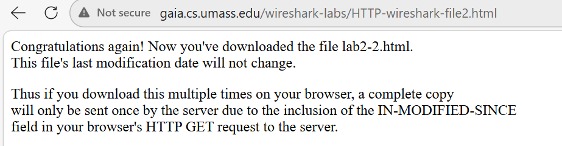 

3. Setelah halaman berhasil dimuat, kembali ke Wireshark dan klik Stop. Pada packet-listing window akan terlihat pesan HTTP yang tertangkap: 
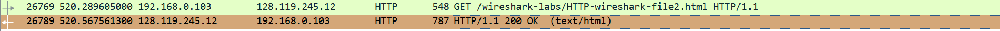 
Berikut hasil analisis paket yang tertangkap: 
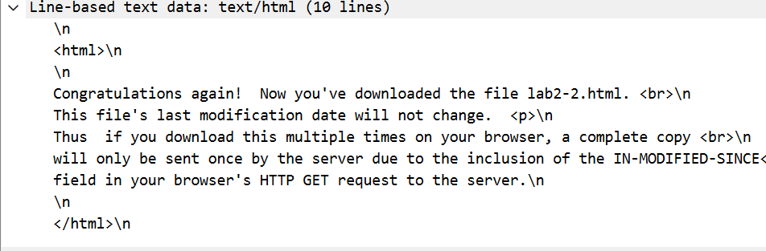 
Pada bagian Line-based text data di detail paket respons kedua, konten yang dikirim server terdiri dari 10 baris HTML, di dalam konten tersebut server menjelaskan bahwa tanggal modifikasi file ini tidak akan berubah, jadi jika halaman diakses berkali-kali, salinan akan dikirim sekali saja oleh server, ini terjadi karena pada permintaan berikutnya browser akan menyertakan header IF-MODIFIED-SINCE dalam HTTP GET nya, dan karena file tidak pernah berubah, server cukup membalas dengan 304 Not Modified tanpa mengirim ulang konten. 

## **Retrieving Long Documents**
1. Pastikan cache dan history browser sudah dibersihkan terlebih dahulu agar browser tidak menggunakan data yang tersimpan dari sesi sebelumnya. 

2. Mulai capture pada Wireshark, lalu buka browser dan akses URL berikut:
http://gaia.cs.umass.edu/wireshark-labs/HTTP-wireshark-file3.html 
Browser akan menampilkan dokumen HTML yang jauh lebih panjang dibanding percobaan sebelumnya, yaitu teks dari "The Bill of Rights" Amerika Serikat. 
Berikut tampilan halaman yang berhasil dibuka: 
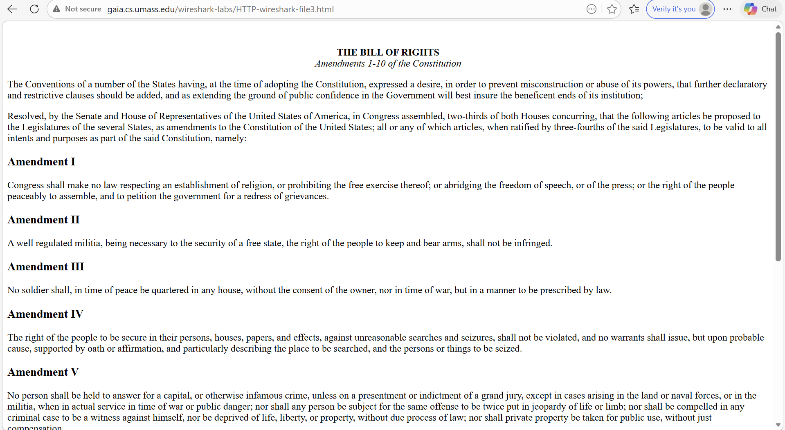 

3. Hentikan capture pada Wireshark dan pastikan filter http masih aktif.
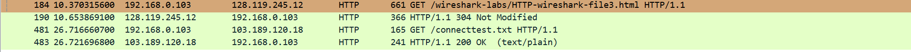 
Server kemudian membalas dengan 304 Not Modified, yang menandakan bahwa file HTML tersebut belum mengalami perubahan sejak terakhir kali diakses, ini karena browser masih menyimpan cache dari sesi sebelumnya sehingga server tidak perlu mengirimkan ulang konten file tersebut. 
Hasil analisis paket yang tertangkap: 
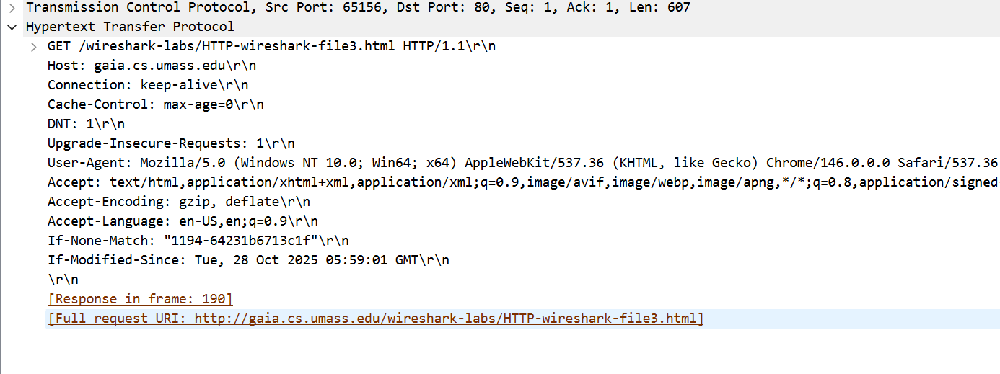 

## **HTML Documents with Embedded Objects**

1. Pastikan cache dan history browser sudah dibersihkan terlebih dahulu agar browser tidak menggunakan data yang tersimpan dari sesi sebelumnya. 

2. Mulai capture pada Wireshark, lalu buka browser dan akses URL berikut:
http://gaia.cs.umass.edu/wireshark-labs/HTTP-wireshark-file4.html
Browser akan menampilkan halaman HTML singkat yang di dalamnya memuat dua gambar eksternal, yaitu logo Pearson dan cover buku.
Berikut tampilan halaman yang berhasil dibuka: 
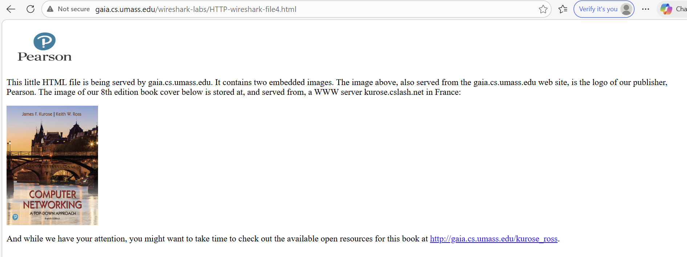 

3. Hentikan capture pada Wireshark. Pada packet-listing window akan terlihat beberapa pesan HTTP GET yang dikirim browser secara berantai. Browser pertama mengambil file HTML utama dan mendapat respons 200 OK, kemudian setelah membaca isi HTML tersebut dan menemukan referensi gambar, browser secara otomatis mengirimkan GET tambahan untuk mengunduh masing-masing gambar yaitu pearson.png dan 8E_cover_small.jpg.
Berikut tampilan Wireshark yang memperlihatkan beberapa HTTP GET sekaligus: 
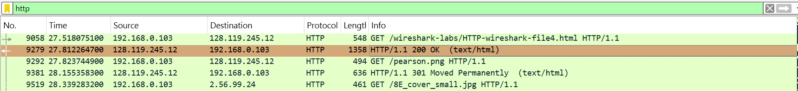 
Pada bagian Line-based text data di detail paket, terlihat secara langsung referensi source link (src) dari kedua gambar tersebut yang tertanam di dalam dokumen HTML. 
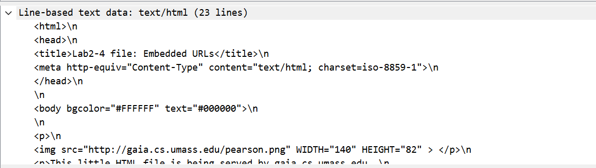 

4. Pengambilan Objek dari Server Berbeda 
   Detail capture paket pada gambar di bawah ini memperlihatkan request HTTP GET untuk objek gambar, yaitu `8E_cover_small.jpg`. 
   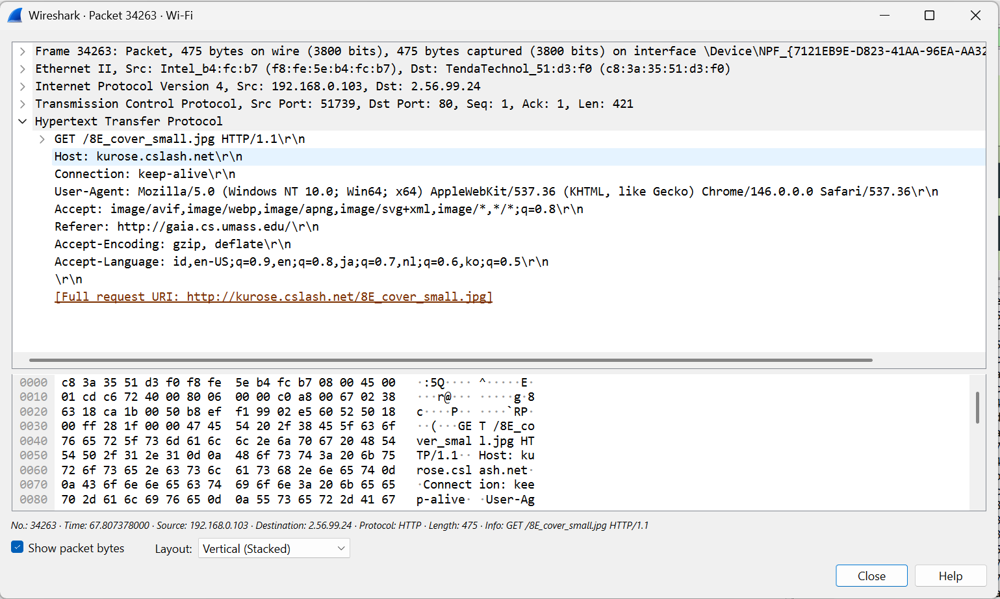 
   Pada bagian header Host, request tersebut tidak lagi ditujukan ke server utama gaia.cs.umass.edu, melainkan dikirim ke server lain yaitu kurose.cslash.net. Selain itu, terdapat header Referer: http://gaia.cs.umass.edu/ yang berarti asal halaman yang merujuk gambar tersebut, artinya dokumen html dapat menaruh dokumen (embed) objek-objek yang di host pada server yang benar-benar berbeda, dan browser akan secara otomatis mengunduhnya untuk menampilkan halaman secara utuh.

## **HTTP Authentication**
1. Pastikan cache dan history browser sudah dibersihkan terlebih dahulu agar browser tidak menggunakan data yang tersimpan dari sesi sebelumnya. 

2. Mulai capture pada Wireshark, lalu buka browser dan akses URL berikut:
http://gaia.cs.umass.edu/wireshark-labs/protected_pages/HTTP-wireshark-file5.html setelah URL terbuka browser akan menampilkan login karena server mendeteksi bahwa halaman ini memerlukan autentikasi sebelum bisa diakses.
Berikut tampilan pop-up login yang muncul: 
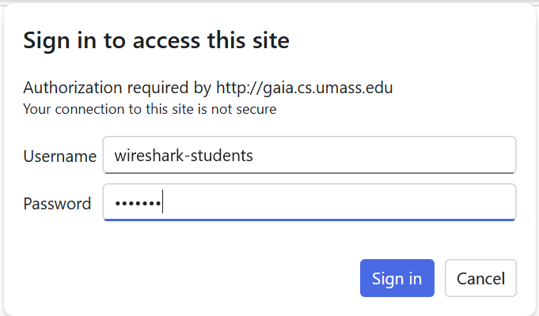 
Masukkan Usn dan Password berikut: 
**Username**: wireshark-students 
**Password**: network 
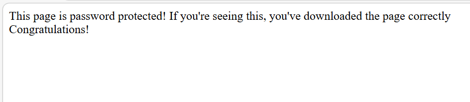 

3. Analisis Capture Wireshark, **Akses Ditolak:** Saat pertama kali diakses, server menolak dengan status 401 Unauthorized karena kita belum memasukkan username dan password. 
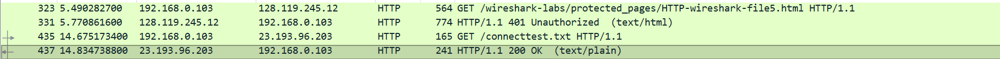 
Setelah kita login, browser mengirim permintaan lagi dengan tambahan tulisan Authorization: Basic, di sini password kita dikirim. 
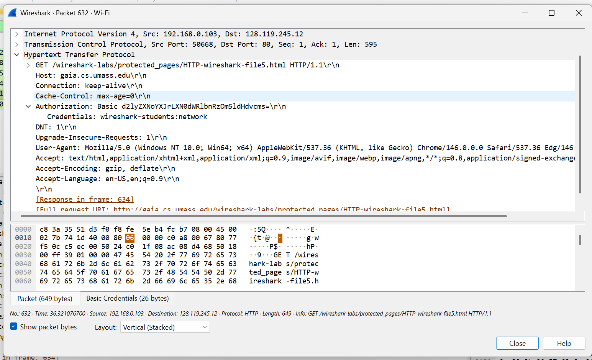 
Berhasil Masuk (Frame 634) Karena password yang dimasukkan benar, server memberi izin dengan status **200 OK**. Halaman web berhasil dibuka dan isinya. 
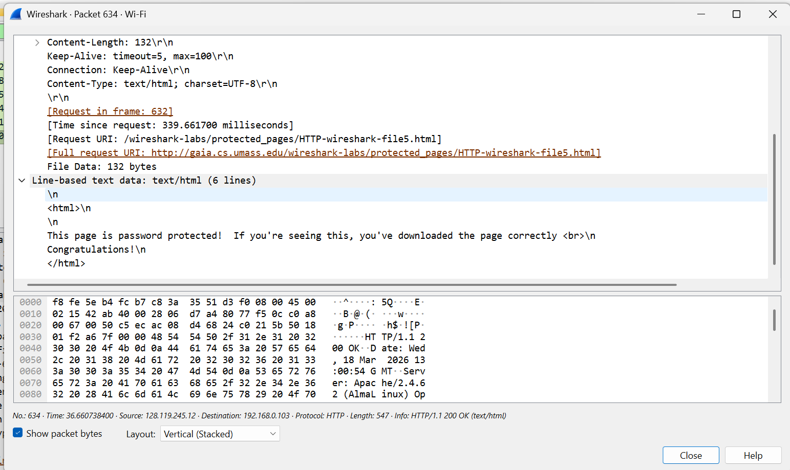 