### **Difa Auliya Andini Putri - 103072400112**

# **Laporan Praktikum Modul 4: DNS**

### **Tujuan Praktikum**
Dapat menginvestigasi cara kerja DNS menggunakan Wireshark.

### **A. Nslookup**
Domain Name System (DNS) merupakan sistem yang digunakan untuk menerjemahkan nama domain menjadi alamat IP agar perangkat dapat saling berkomunikasi dalam jaringan. Pada praktikum ini digunakan perintah nslookup untuk melakukan query ke server DNS dan mengamati respon yang diberikan.

### **Perintah 1 - jalankan:**
nslookup www.mit.edu 

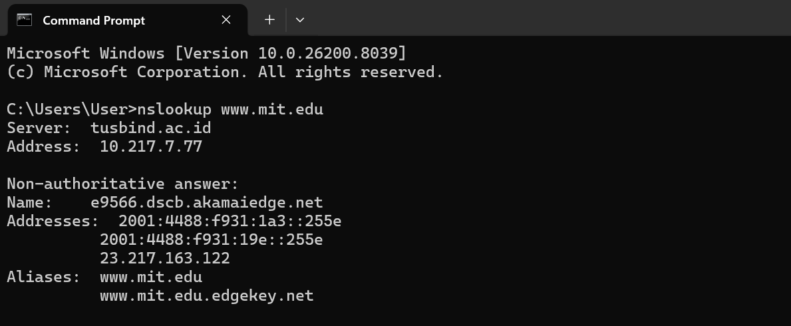 

Perintah ini digunakan untuk meminta alamat IP dari domain www.mit.edu dengan menggunakan DNS server lokal. Hasilnya menunjukkan sistem menggunakan DNS server tusbind.ac.id dengan alamat IP 10.217.7.77. Respon yang diberikan bersifat non-authoritative, yang menandakan bahwa jawaban tidak langsung berasal dari server DNS otoritatif, melainkan dari cache atau hasil query ke server DNS lain, hasil juga menampilkan nama host dan alamat IP dari domain yang dicari. 

### **Perintah 2- jalankan:**
nslookup -type=NS mit.edu 

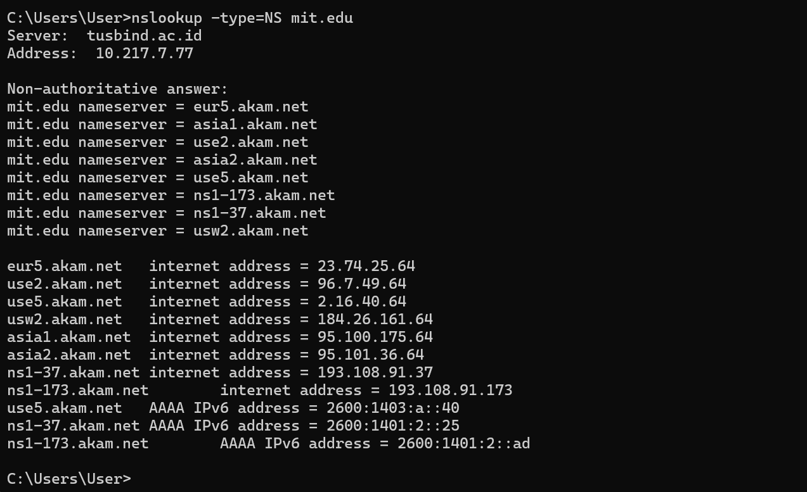 

Perintah ini digunakan untuk mengetahui server DNS yang bertanggung jawab terhadap domain mit.edu dengan menggunakan opsi -type=NS. Hasil yang diperoleh menunjukkan bahwa sistem menggunakan DNS server tusbind.ac.id dengan alamat IP 10.217.7.77. Respon yang diberikan bersifat non-authoritative, yang menandakan bahwa jawaban tidak langsung berasal dari server DNS otoritatif. hasil menampilkan beberapa nama server yang menangani domain mit.edu, yang merupakan server DNS otoritatif untuk domain tersebut, beserta alamat IP yang terkait. 

### **Perintah 3- jalankan:**
nslookup www.aiit.or.kr bitsy.mit.edu 

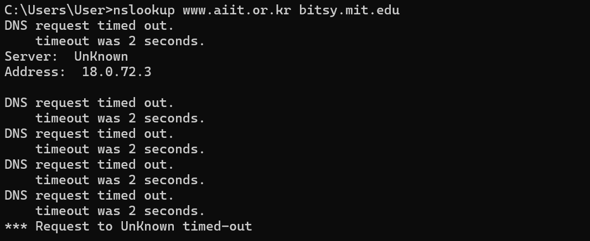 

Perintah ini digunakan untuk meminta alamat IP dari domain www.aiit.or.kr dengan mengirimkan query langsung ke DNS server bitsy.mit.edu, bukan ke DNS server lokal, permintaan tidak mendapatkan respon dan mengalami timeout. ini menunjukkan bahwa server DNS yang dituju tidak memberikan jawaban terhadap permintaan yang dikirimkan. Kondisi ini dapat terjadi karena beberapa kemungkinan, seperti server tidak aktif, tidak dapat diakses, atau adanya pembatasan jaringan seperti firewall. 

### **Pengujian Mandiri**
a. Jalankan nslookup untuk mendapatkan alamat IP dari server web di Asia. Berapa alamat IP 
server tersebut? 

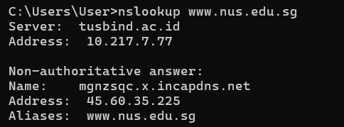 

Perintah ini digunakan untuk mendapatkan alamat IP dari server web di Asia. Berdasarkan hasil yang diperoleh, alamat IP dari server tersebut adalah **45.60.35.225**. 

b. Jalankan nslookup agar dapat mengetahui server DNS otoritatif untuk universitas di Eropa. 

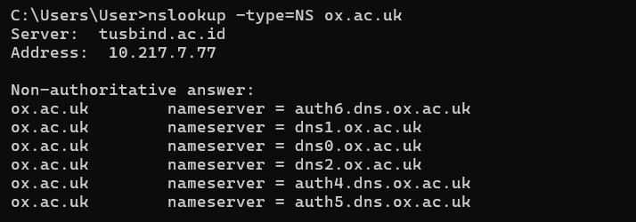 

Perintah ini digunakan untuk mengetahui server DNS otoritatif dari universitas di Eropa, yaitu domain **ox.ac.uk**. server DNS yang menangani domain tersebut adalah **auth6.dns.ox.ac.uk, dns1.ox.ac.uk, dns0.ox.ac.uk, dns2.ox.ac.uk, auth4.dns.ox.ac.uk, dan auth5.dns.ox.ac.uk**, domain universitas tersebut memiliki beberapa server DNS otoritatif untuk meningkatkan keandalan dan ketersediaan layanan. 

c. Jalankan nslookup untuk mencari tahu informasi mengenai server email dari Yahoo! Mail 
melalui salah satu server yang didapatkan di pertanyaan nomor 2. Apa alamat IP-nya? 

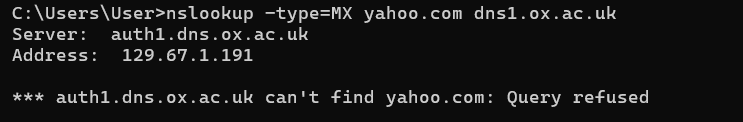 
Pada percobaan ini, permintaan ke server DNS ox.ac.uk tidak berhasil dan menghasilkan query refused, yang menunjukkan bahwa server tersebut tidak melayani permintaan dari luar. 

Selanjutnya dilakukan query menggunakan DNS server lokal: 
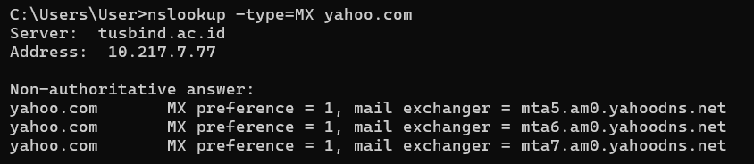 

Berdasarkan hasil yang diperoleh, server email untuk yahoo.com adalah mta5.am0.yahoodns.net, mta6.am0.yahoodns.net, dan mta7.am0.yahoodns.net. 

### **B. Ipconfig**
Perintah ipconfig merupakan salah satu tools yang digunakan untuk melihat dan membantu mendiagnosis konfigurasi jaringan pada host. Perintah ini dapat menampilkan informasi terkait TCP/IP, seperti alamat IP, server DNS, jenis adaptor, dan informasi jaringan lainnya.
Dengan menggunakan perintah ipconfig, pengguna dapat mengetahui kondisi jaringan yang sedang digunakan serta membantu dalam proses troubleshooting jika terjadi masalah koneksi.

### **Perintah 2 - jalankan:**
**ipconfig /displaydns** 

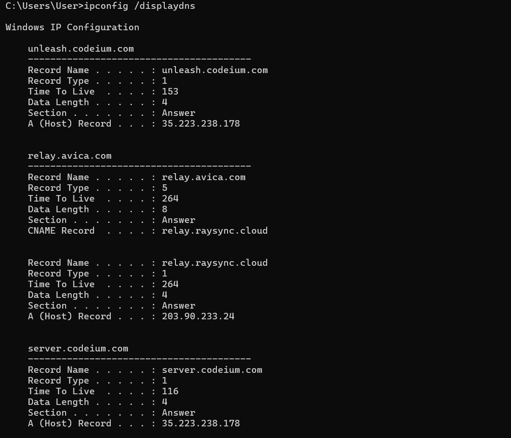 

Perintah ini digunakan untuk menampilkan daftar DNS cache yang tersimpan pada host. Berdasarkan hasil yang diperoleh, terlihat beberapa domain yang pernah diakses seperti unleash.codeium.com, relay.avica.com, dan server.codeium.com beserta alamat IP-nya. sistem menyimpan hasil resolusi DNS sementara untuk mempercepat akses ke domain yang sama tanpa harus melakukan query ulang ke server DNS. 

### **Perintah 3 - jalankan:**
**ipconfig /flushdns** 

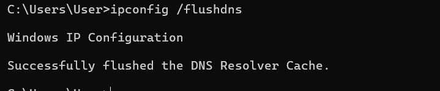 

Perintah ini digunakan untuk menghapus seluruh DNS cache yang tersimpan pada sistem. Berdasarkan hasil yang diperoleh, proses penghapusan cache berhasil dilakukan yang ditandai dengan pesan “Successfully flushed the DNS Resolver Cache”. semua data DNS yang tersimpan sebelumnya telah dihapus, sehingga sistem akan melakukan query ulang ke DNS server saat mengakses domain. 

### **Tracing DNS dengan Wireshark**

**Langkah-Langkah:**
1. Buka Command Prompt (CMD), lalu jalankan perintah berikut untuk mengetahui alamat IP host: (10.218.1.58) 

    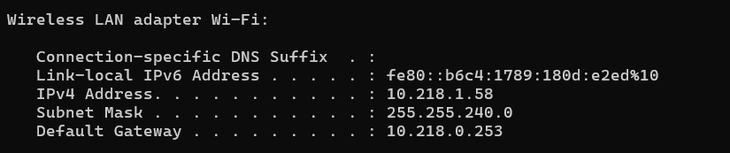 

2. jalankan **ipconfig /flushdns** untuk mengosongkan DNS cache: 
 

3. Buka browser dan kosongkan cache agar tidak menggunakan data yang tersimpan sebelumnya.

4. Buka Wireshark, lalu masukkan filter: "ip.addr == <your_IP_address>" Bagian 
<your_IP_address> diisi dengan alamat IP Anda yang didapatkan melalui ipconfig. 

    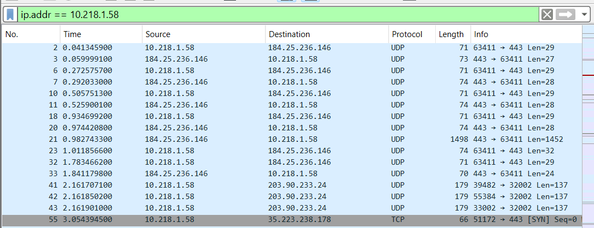 

5. Mulai proses capture paket di Wireshark.

6. Buka browser dan akses website: http://www.ietf.org 
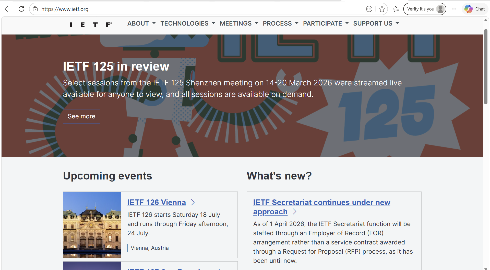 

7. Setelah halaman terbuka, hentikan proses capture.

**Jawab beberapa pertanyaan berikut:**
1. Cari pesan permintaan DNS dan balasannya. Apakah pesan tersebut dikirimkan melalui UDP 
atau TCP? 
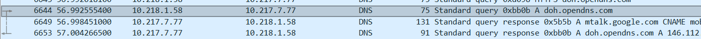 

    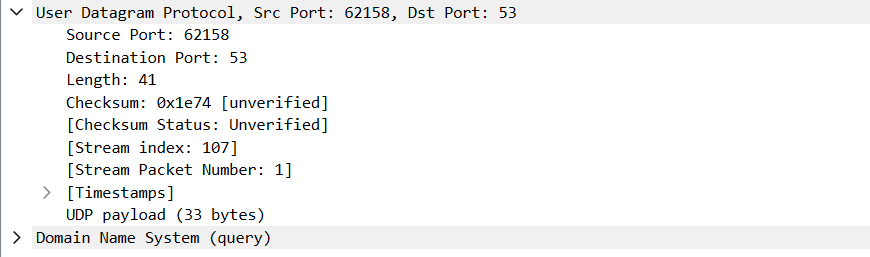 
Berdasarkan hasil pengamatan pada paket DNS, pesan permintaan (Standard query) dikirimkan menggunakan protokol UDP, pada bagian User Datagram Protocol, pesan permintaan dan balasan DNS menggunakan UDP.

2. Apa port tujuan pada pesan permintaan DNS? Apa port sumber pada pesan balasannya? 

    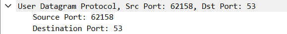 
Port tujuan pada pesan permintaan DNS adalah 53, port sumber yang digunakan pada pesan balasan DNS adalah 62158, yaitu port yang sebelumnya digunakan oleh client saat mengirim permintaan.  
DNS Request -> Source Port (client): 62158 & Destination Port (server): 53 
DNS Response -> Source Port (server): 53 & Destination Port (client): 62158 

3. Pada pesan permintaan DNS, apa alamat IP tujuannya? Apa alamat IP server DNS lokal anda 
(gunakan ipconfig untuk mencari tahu)? Apakah kedua alamat IP tersebut sama? 
    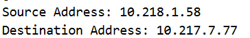 
A   lamat IP tujuan adalah 10.217.7.77. DNS server lokal host juga memiliki alamat IP 10.217.7.77. kedua alamat IP tersebut sama, permintaan DNS dikirim langsung ke DNS server lokal. 

4. Periksa pesan permintaan DNS. Apa “jenis” atau ”type” dari pesan tersebut? Apakah pesan 
permintaan tersebut mengandung ”jawaban” atau ”answers”?  

    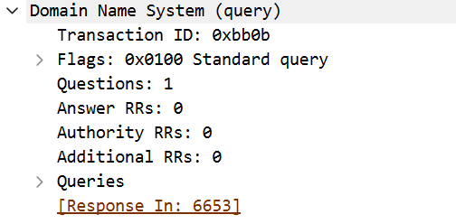 
Dari pesan tersebut adalah A (Address), yaitu untuk meminta alamat IP dari suatu domain, pesan permintaan tidak mengandung answer, nilai Answer RRs: 0. 

5.  Periksa pesan balasan DNS. Berapa banyak ”jawaban” atau ”answers” yang terdapat di 
dalamnya? Apa saja isi yang terkandung dalam setiap jawaban tersebut? 

    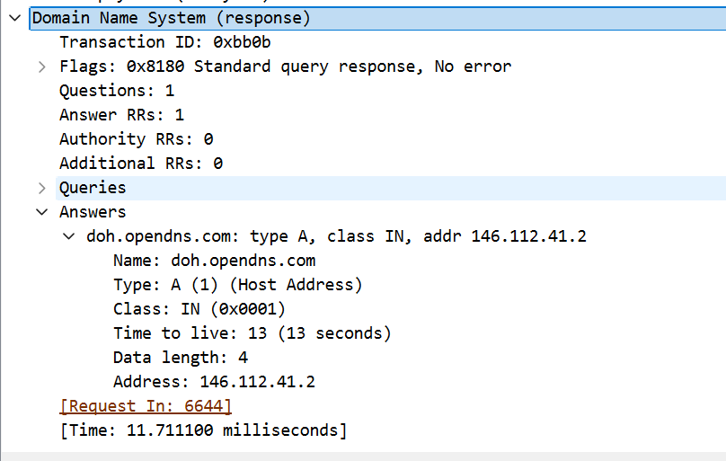 
    pesan balasan DNS (Standard query response), terdapat 1 answer, Answer RRs: 1. Isi dari jawaban tersebut adalah alamat IP dari domain yang diminta, 146.112.41.2 untuk domain doh.opendns.com 

6. Perhatikan paket TCP SYN yang selanjutnya dikirimkan oleh host Anda. Apakah alamat IP pada paket tersebut sesuai dengan alamat IP yang tertera pada pesan balasan DNS? 