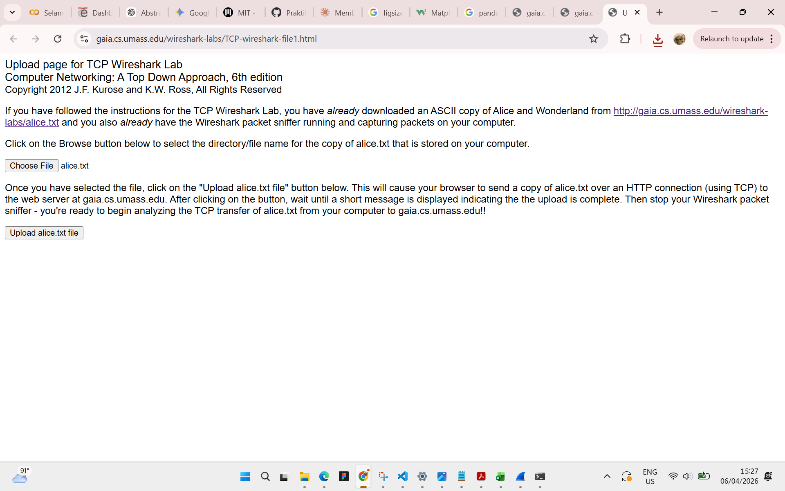
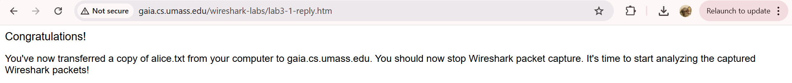
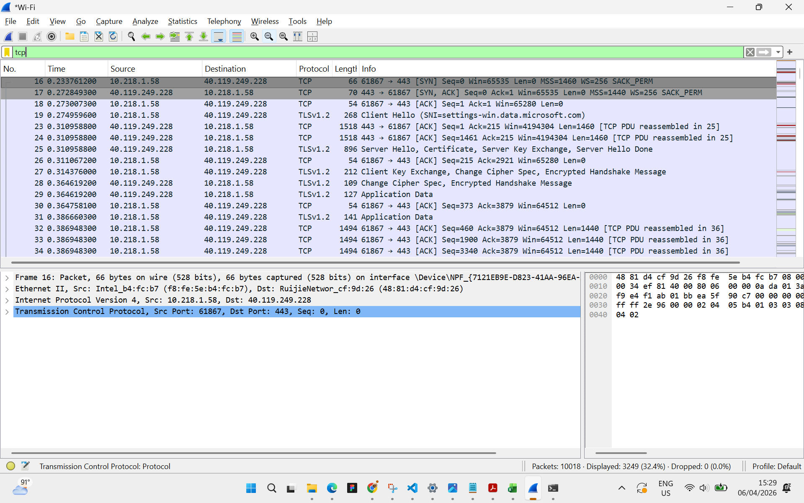
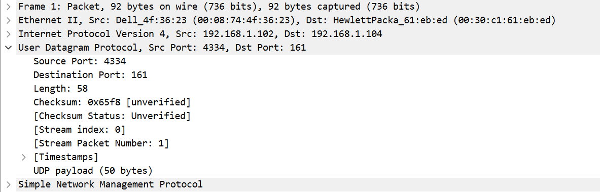
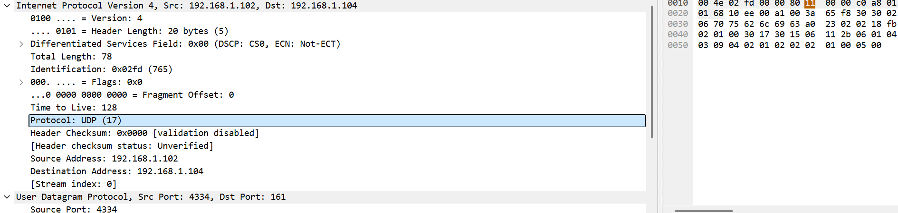

### **Difa Auliya Andini Putri - 103072400112**

# **Laporan Praktikum Modul 6: TCP**

### **Tujuan Praktikum**
Dapat dapat  menginvestigasi cara kerja protokol TCP menggunakan Wireshark 

### **Pendahuluan**
Pada modul ini dilakukan analisis terhadap protokol transport TCP (Transmission Control Protocol) secara lebih mendalam menggunakan Wireshark. TCP merupakan protokol yang bersifat connection-oriented dan menyediakan komunikasi yang andal melalui mekanisme seperti sequence number, acknowledgement, flow control, dan congestion control. Dalam praktikum ini diamati proses transfer file dari komputer klien ke server, sehingga dapat dianalisis bagaimana TCP membangun koneksi (three-way handshake), mengirim data, serta mengatur kecepatan pengiriman untuk menghindari kemacetan jaringan.

### **Menangkap Tansfer TCP dalam Jumlah Besar dari Komputer Pribadi ke Remote Server**

**Langkah - Langkah Percobaan:**

1. Jalankan browser web. Buka http://gaia.cs.umass.edu/wireshark-labs/alice.txt dan unduh salinan ASCII dari naskah Alice in Wonderland. Simpan file tersebut. 

2. Selanjutnya buka http://gaia.cs.umass.edu/wireshark-labs/TCP-wireshark-file1.html.

3. Gunakan tombol Choose File untuk memilih file alice.txt yang telah diunduh, namun jangan menekan tombol upload terlebih dahulu.
4. Jalankan Wireshark dan mulai proses pengambilan paket (capture).
5. Kembali ke browser, kemudian tekan tombol Upload alice.txt file untuk mengunggah file ke server gaia.cs.umass.edu.
6. Setelah proses upload selesai, halaman akan menampilkan pesan ucapan selamat sebagai tanda bahwa file berhasil dikirim.
7. Hentikan proses pengambilan paket pada Wireshark.
Berikut tampilan halaman upload sebelum tombol upload ditekan: 

     

    dan setelah file berhasil diunggah ke server: 
     

### **Tampilan Awal pada Captured Trace** 
Pertama, lakukan filter terhadap paket yang ditampilkan pada jendela Wireshark dengan 
cara memasukkan ”tcp” (huruf kecil, tanpa tanda petik, dan jangan lupa untuk menekan 
tombol return setelahnya) ke dalam kolom filter yang terdapat di bagian atas. 
     

**Pertanyaan:**

1. Berapa alamat IP dan nomor port TCP yang digunakan oleh komputer klien (sumber) untuk 
mentransfer file ke gaia.cs.umass.edu? Cara paling mudah menjawab pertanyaan ini adalah 
dengan memilih sebuah pesan HTTP dan meneliti detail paket TCP yang digunakan untuk 
membawa pesan HTTP tersebut. 

     
    pada bagian User Datagram Protocol, header UDP terdiri dari empat field utama, yaitu: 
    Source Port 
    Destination Port 
    Length 
    Checksum 
    Keempat field tersebut merupakan komponen standar yang digunakan untuk mengidentifikasi sumber dan tujuan komunikasi, panjang data, serta pengecekan kesalahan.

2. Perhatikan informasi “content field” pada paket yang Anda pilih di pertanyaan 1. Berapa 
panjang (dalam satuan byte) masing-masing “field” yang terdapat pada header UDP? 

     
Setiap field pada header UDP memiliki panjang yang sama, yaitu 2 byte, dengan rincian: 
Source Port: 2 byte 
Destination Port: 2 byte 
Length: 2 byte 
Checksum: 2 byte 
Dengan demikian, total panjang header UDP adalah 8 byte, yang menunjukkan bahwa struktur UDP bersifat sederhana dan tetap.

3.  Nilai yang tertera pada ”Length” menyatakan nilai apa? Verfikasi jawaban Anda melalui paket UDP pada trace.  

     
Field Length menunjukkan total panjang segmen UDP yang mencakup header dan payload. Berdasarkan paket yang dianalisis diperoleh:
- Length = 58 byte
- Header = 8 byte
- Payload = 50 byte 
 Hasil tersebut sesuai karena 8 + 50 = 58 byte, sehingga dapat disimpulkan bahwa field Length merepresentasikan total panjang segmen UDP secara keseluruhan.

4.  Berapa jumlah maksimum byte yang dapat disertakan dalam payload UDP? (Petunjuk: jawaban untuk pertanyaan ini dapat ditentukan dari jawaban Anda untuk pertanyaan 2)  

    Field Length memiliki ukuran 2 byte (16 bit) sehingga nilai maksimum yang dapat direpresentasikan adalah 65.535 byte. Karena nilai tersebut mencakup header UDP, maka maksimum payload yang dapat dikirim adalah:

    65.535 − 8 = 65.527 byte

    kapasitas maksimum data dalam satu segmen UDP adalah 65.527 byte.

5. Berapa nomor port terbesar yang dapat menjadi port sumber? (Petunjuk: lihat petunjuk pada pertanyaan 4) 

    Field port pada UDP memiliki panjang 2 byte (16 bit), sehingga nilai maksimum yang dapat digunakan adalah:

    2¹⁶ − 1 = 65.535

    Dengan demikian, nomor port terbesar yang dapat digunakan sebagai port sumber adalah 65.535, dengan rentang port dari 0 hingga 65.535.

6. Berapa nomor protokol untuk UDP? Berikan jawaban Anda dalam notasi heksadesimal dan 
desimal. Untuk menjawab pertanyaan ini, Anda harus melihat ke bagian ”Protocol” pada 
datagram IP yang mengandung segmen UDP 

    Berdasarkan pengamatan pada header IP, protokol UDP memiliki nomor:

    Desimal: 17
    Heksadesimal: 0x11

    Nilai ini digunakan pada field Protocol di header IP untuk menandakan bahwa datagram membawa segmen UDP.
     

7. Periksa pasangan paket UDP di mana host Anda mengirimkan paket UDP pertama dan paket 
UDP kedua merupakan balasan dari paket UDP yang pertama. (Petunjuk: agar paket kedua 
merupakan balasan dari paket pertama, pengirim paket pertama harus menjadi tujuan dari 
paket kedua). Jelaskan hubungan antara nomor port pada kedua paket tersebut!

    Berdasarkan pengamatan pasangan paket UDP, terlihat bahwa nomor port pada paket request dan response saling berkebalikan. Pada paket request:

- Source Port = 4334
- Destination Port = 161

    Sedangkan pada paket response:

