### **Difa Auliya Andini Putri - 103072400112**

# **Laporan Praktikum Modul 6: TCP**

### **Tujuan Praktikum**
Dapat dapat  menginvestigasi cara kerja protokol TCP menggunakan Wireshark 

### **Pendahuluan**
Pada modul ini dilakukan analisis terhadap protokol transport TCP (Transmission Control Protocol) secara lebih mendalam menggunakan Wireshark. TCP merupakan protokol yang bersifat connection-oriented dan menyediakan komunikasi yang andal melalui mekanisme seperti sequence number, acknowledgement, flow control, dan congestion control. Dalam praktikum ini diamati proses transfer file dari komputer klien ke server, sehingga dapat dianalisis bagaimana TCP membangun koneksi (three-way handshake), mengirim data, serta mengatur kecepatan pengiriman untuk menghindari kemacetan jaringan.

### **Menangkap Tansfer TCP dalam Jumlah Besar dari Komputer Pribadi ke Remote Server**

**Langkah - Langkah Percobaan:**

1. Jalankan browser web. Buka http://gaia.cs.umass.edu/wireshark-labs/alice.txt dan unduh salinan ASCII dari naskah Alice in Wonderland. Simpan file tersebut. 

2. Selanjutnya buka http://gaia.cs.umass.edu/wireshark-labs/TCP-wireshark-file1.html.

3. Gunakan tombol Choose File untuk memilih file alice.txt yang telah diunduh, namun jangan menekan tombol upload terlebih dahulu.
4. Jalankan Wireshark dan mulai proses pengambilan paket (capture).
5. Kembali ke browser, kemudian tekan tombol Upload alice.txt file untuk mengunggah file ke server gaia.cs.umass.edu.
6. Setelah proses upload selesai, halaman akan menampilkan pesan ucapan selamat sebagai tanda bahwa file berhasil dikirim.
7. Hentikan proses pengambilan paket pada Wireshark.
Berikut tampilan halaman upload sebelum tombol upload ditekan: 

     

    dan setelah file berhasil diunggah ke server: 
     

### **Tampilan Awal pada Captured Trace** 
Pertama, lakukan filter terhadap paket yang ditampilkan pada jendela Wireshark dengan 
cara memasukkan ”tcp” (huruf kecil, tanpa tanda petik, dan jangan lupa untuk menekan 
tombol return setelahnya) ke dalam kolom filter yang terdapat di bagian atas. 
     

**Pertanyaan:**

1. Berapa alamat IP dan nomor port TCP yang digunakan oleh komputer klien (sumber) untuk 
mentransfer file ke gaia.cs.umass.edu? Cara paling mudah menjawab pertanyaan ini adalah 
dengan memilih sebuah pesan HTTP dan meneliti detail paket TCP yang digunakan untuk 
membawa pesan HTTP tersebut. 

    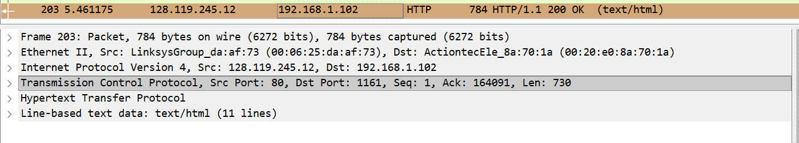 
   alamat IP komputer klien adalah 192.168.1.102, dan nomor port TCP yang digunakan adalah 1161 untuk mengirim data ke gaia.cs.umass.edu.

2. Apa alamat IP dari gaia.cs.umass.edu? Pada nomor port berapa ia mengirim dan menerima segmen TCP untuk koneksi ini?  

    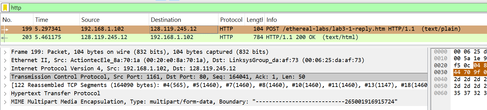 
alamat IP dari gaia.cs.umass.edu adalah 128.119.245.12, dan server tersebut menggunakan port 80 untuk mengirim dan menerima segmen TCP pada koneksi ini.

### **DASAR TCP**
1. Berapa nomor urut segmen TCP SYN yang digunakan untuk memulai sambungan TCP antara 
komputer klien dan gaia.cs.umass.edu? Apa yang dimiliki segmen tersebut sehingga 
teridentifikasi sebagai segmen SYN?  

    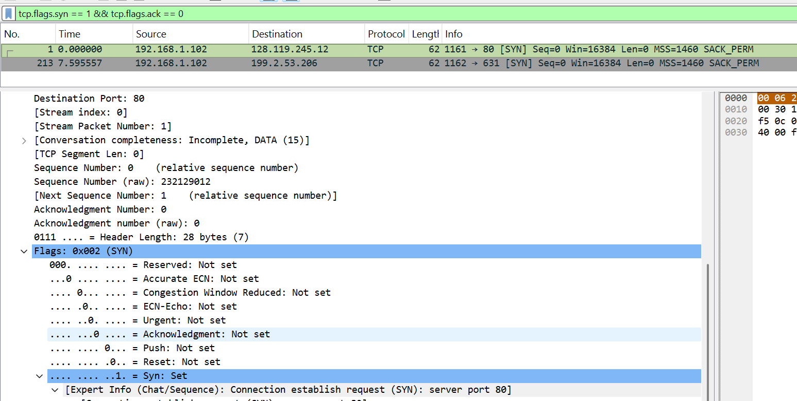 
nomor urut (sequence number) segmen TCP SYN yang digunakan untuk memulai koneksi adalah 0 (relative sequence number). segmen tersebut sebagai segmen SYN karena memiliki flag SYN = 1 dan ACK = 0, yang menandakan bahwa paket tersebut merupakan permintaan awal untuk membangun koneksi TCP (connection establishment).

2. Berapa nomor urut segmen SYNACK yang dikirim oleh gaia.cs.umass.edu ke komputer klien 
sebagai balasan dari SYN? Berapa nilai dari field Acknowledgement pada segmen SYNACK? 
Bagaimana gaia.cs.umass.edu menentukan nilai tersebut? Apa yang dimiliki oleh segmen  
sehingga teridentifikasi sebagai segmen SYNACK? 

    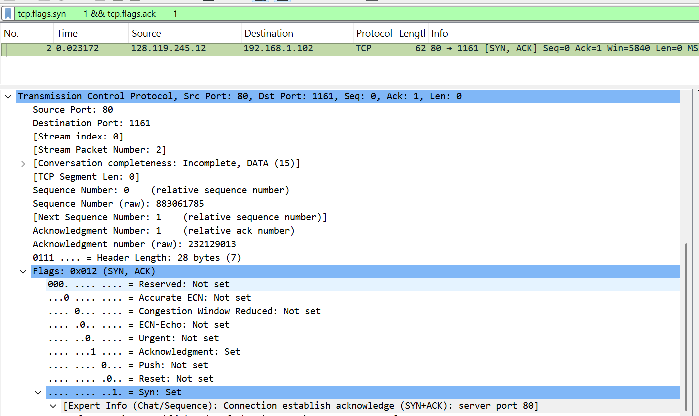 
nomor urut (sequence number) segmen SYN-ACK adalah 0 (relative sequence number). nilai field acknowledgment adalah 1. nilai acknowledgment tersebut diperoleh dari sequence number segmen SYN sebelumnya ditambah 1, yaitu dari 0 menjadi 1. segmen ini dapat diidentifikasi sebagai SYN-ACK karena memiliki flag SYN = 1 dan ACK = 1, yang menunjukkan bahwa segmen tersebut merupakan balasan dari permintaan koneksi sekaligus persetujuan untuk membangun koneksi TCP.

3. Berapa nomor urut segmen TCP yang berisi perintah HTTP POST? Perhatikan bahwa untuk 
menemukan perintah POST, Anda harus menelusuri content field milik paket di bagian 
bawah jendela Wireshark, kemudian cari segmen yang berisi "POST" di bagian field DATA
nya. 

    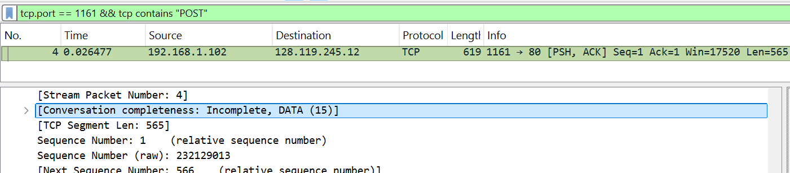 
nomor urut (sequence number) segmen TCP yang berisi perintah HTTP POST adalah 1 (relative sequence number). segmen ini dapat dikenali karena memiliki payload yang berisi data HTTP (POST) dan ditandai dengan flag PSH, ACK, yang menunjukkan bahwa data dikirim langsung ke aplikasi tujuan.

4. Anggap segmen TCP yang berisi HTTP POST sebagai segmen pertama dalam koneksi TCP. 
Berapa nomor urut dari enam segmen pertama dalam TCP (termasuk segmen yang berisi 
HTTP POST)? Pada jam berapa setiap segmen dikirim? Kapan ACK untuk setiap segmen 
diterima? Dengan adanya perbedaan antara kapan setiap segmen TCP dikirim dan kapan 
acknowledgement-nya diterima, berapakah nilai RTT untuk keenam segmen tersebut? 
Berapa nilai EstimatedRTT setelah penerimaan setiap ACK? (Catatan: Wireshark memiliki 
fitur yang memungkinkan Anda untuk memplot RTT untuk setiap segmen TCP yang dikirim. 
Pilih segmen TCP yang dikirim dari klien ke server gaia.cs.umass.edu pada jendela "daftar 
35 
JARINGAN KOMPUTER 
paket yang ditangkap". Kemudian pilih: Statistics->TCP Stream Graph- >Round Trip Time 
Graph).  

    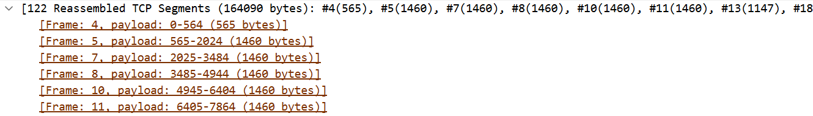 
berdasarkan hasil reassembled TCP segments, enam segmen pertama memiliki panjang sebagai berikut:

    enam segmen pertama (dimulai dari segmen HTTP POST) memiliki sequence number: 1, 566, 2026, 3486, 4946, dan 6406.

    **Grafik Round Trip Time RTT:** 
    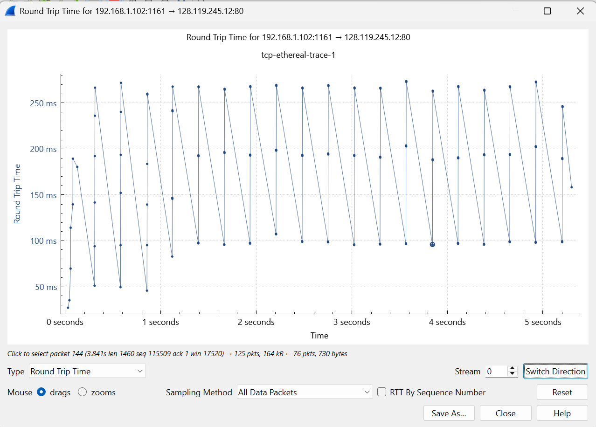 
berdasarkan grafik Round Trip Time, nilai RTT untuk segmen-segmen tersebut berada pada kisaran ±100 ms hingga ±270 ms.

    nilai RTT diperoleh dari selisih waktu antara pengiriman segmen dan penerimaan acknowledgment (ACK). EstimatedRTT berada di sekitar nilai rata-rata RTT, yaitu ±180 ms, dan berubah secara bertahap mengikuti nilai RTT yang diperoleh sehingga tidak mengalami perubahan yang drastis.

5. Berapa panjang setiap enam segmen TCP pertama? 
     

- segmen 1 = 565 byte
- segmen 2 = 1460 byte
- segmen 3 = 1460 byte
- segmen 4 = 1460 byte
- segmen 5 = 1460 byte
- segmen 6 = 1460 byte 
data tersebut diperoleh dari frame 4, 5, 7, 8, 10, dan 11 yang menunjukkan ukuran payload masing-masing segmen. sebagian besar segmen memiliki ukuran maksimum (1460 byte), sedangkan segmen pertama lebih kecil karena merupakan awal pengiriman data.

6. Berapa jumlah minimum ruang buffer tersedia yang disarankan kepada penerima dan 
diterima untuk seluruh trace? Apakah kurangnya ruang buffer penerima pernah 
menghambat pengiriman? 

    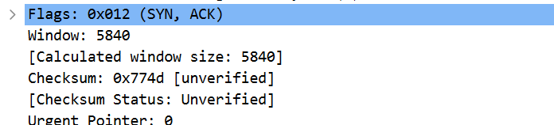 
berdasarkan hasil pengamatan pada field TCP di Wireshark, nilai window size yang ditampilkan adalah 5840 byte. nilai ini menunjukkan jumlah ruang buffer minimum yang tersedia pada sisi penerima untuk menerima data dari pengirim.

7.  Apakah ada segmen yang ditransmisikan ulang dalam file trace? Apa yang anda periksa (di 
dalam file trace) untuk menjawab pertanyaan ini?  

    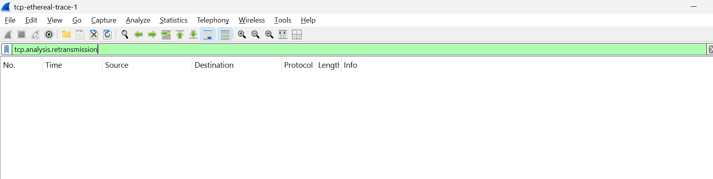 
berdasarkan hasil filter tcp.analysis.retransmission pada Wireshark, tidak ditemukan adanya segmen yang ditransmisikan ulang (retransmission) pada trace tersebut.

8. Berapa banyak data yang biasanya diakui oleh penerima dalam ACK? Dapatkah anda 
mengidentifikasi kasus-kasus di mana penerima melakukan ACK untuk setiap segmen yang 
diterima? 

    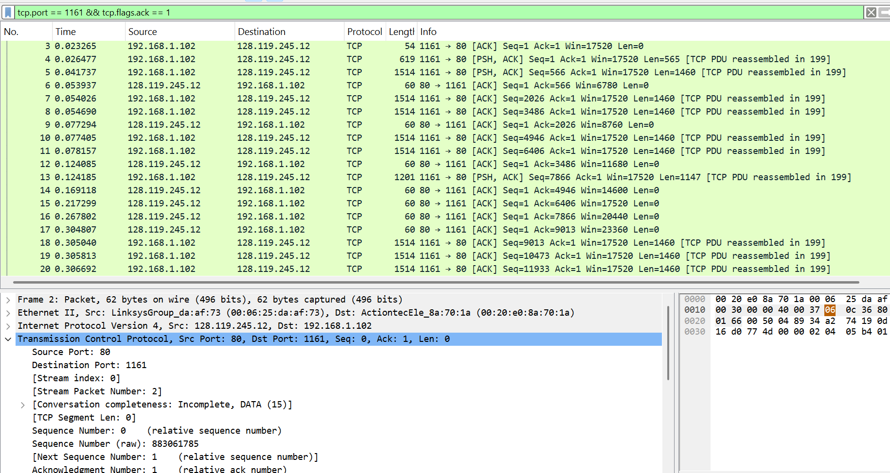 
berdasarkan hasil pengamatan paket TCP, penerima tidak selalu mengirim ACK untuk setiap segmen yang diterima. terlihat bahwa beberapa ACK mengakui lebih dari satu segmen sekaligus (cumulative ACK). 
contohnya: 
ACK dengan nilai Ack=566 mengakui segmen pertama
ACK berikutnya seperti Ack=2026, 3486, 4946, 6406 menunjukkan bahwa beberapa data telah diterima sekaligus sebelum ACK dikirim. TCP menggunakan mekanisme cumulative acknowledgment, di mana satu ACK dapat mengakui beberapa segmen data sekaligus untuk meningkatkan efisiensi komunikasi.

9. Berapa throughput (byte yang ditransfer per satuan waktu) untuk sambungan TCP? 
Jelaskan bagaimana Anda menghitung nilai ini.  

    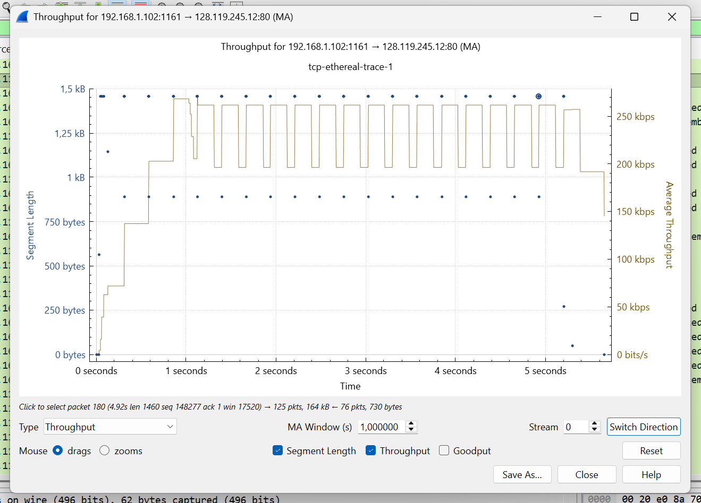 
    berdasarkan grafik Throughput pada Wireshark, nilai throughput koneksi TCP berada pada kisaran sekitar 200 kbps hingga 250 kbps, dengan rata-rata sekitar ±230 kbps.nilai throughput ini diperoleh dari jumlah data yang berhasil dikirim dibagi dengan waktu transmisi, yang ditampilkan langsung pada grafik throughput.dari grafik terlihat bahwa throughput relatif stabil selama proses transfer, meskipun terdapat sedikit fluktuasi pada beberapa waktu tertentu.

### **Congestion Control pada TCP**
Sekarang mari kita periksa jumlah data yang dikirim per satuan waktu dari klien ke server. Kita akan 
menggunakan salah satu fitur grafik TCP Wireshark ‒Time-Sequence-Graph(Stevens)‒ untuk 
memplot data.

 
Pilih segmen TCP yang dikirim klien di jendela "daftar paket yang diambil" Wireshark. 
Kemudian pilih menu: Statistics->TCP Stream Graph-> Time-Sequence-Graph(Stevens). Plot tersebut dibuat dari 
paket yang ditangkap trace tcp-ethereal-trace-1

1. Gunakan alat plotting Time-Sequence-Graph (Stevens) untuk melihat grafik nomor urut 
berbanding waktu dari segmen yang dikirim oleh klien ke server gaia.cs.umass.edu. 
Dapatkah Anda mengidentifikasi di mana fase “slow start” TCP dimulai dan berakhir, dan 
pada bagian mana algoritma ”congestion avoidance” mengambil alih? Berikan komentar 
tentang bagaimana data yang diukur berbeda dari perilaku ideal TCP yang telah kita pelajari.
- Buka file tcp-ethereal-trace-1 dengan wireshark
- Filter "TCP"
- Statistics -> TCP Stream Graph -> Time-Sequence Graph (Stevens) 

    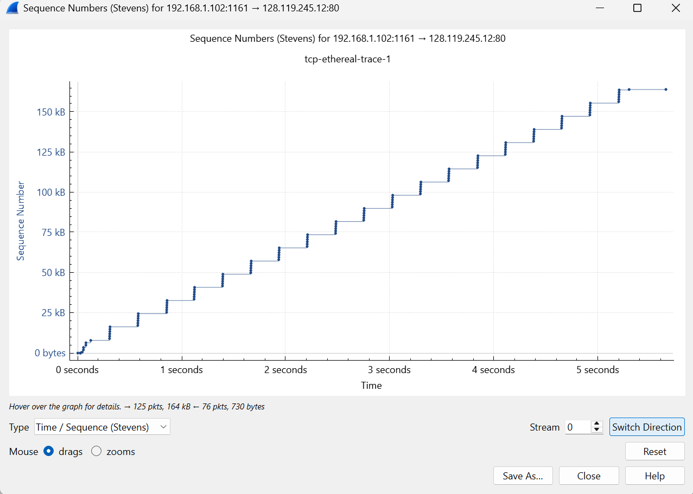 
berdasarkan grafik Time-Sequence (Stevens), fase slow start terjadi pada bagian awal grafik, yaitu saat kurva naik secara eksponensial (tajam). fase ini terlihat pada interval waktu sekitar 0 hingga ±0.5 detik, di mana kenaikan sequence number sangat cepat. setelah itu, grafik mulai berubah menjadi lebih linear, yang menandakan bahwa fase congestion avoidance telah mengambil alih. pada fase ini, pertumbuhan sequence number menjadi lebih stabil dan bertahap.

2. Identifikasi Slow Start & Congestion Avoidance (menggunakan file alice) 

    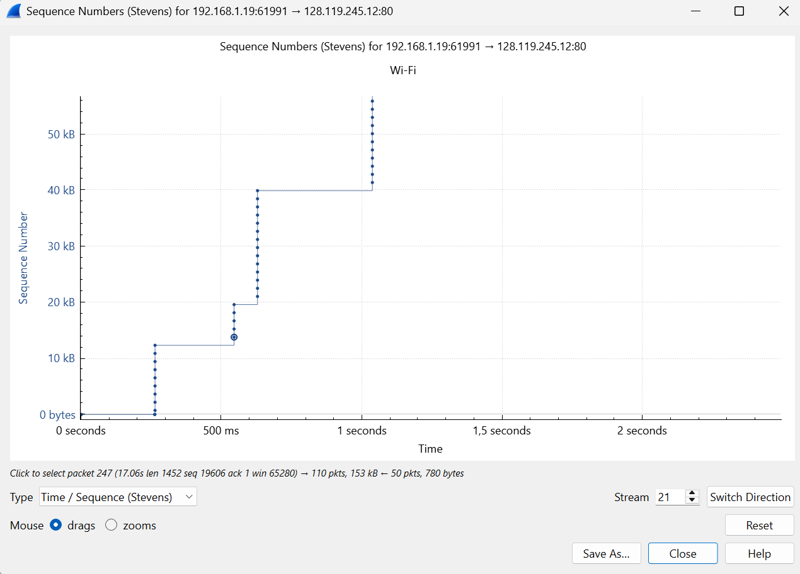 
Pada grafik (file alice), fase slow start terlihat pada awal koneksi dengan kenaikan sequence number yang cukup cepat (cenderung eksponensial). Setelah itu, terjadi transisi ke congestion avoidance sekitar pertengahan awal waktu, yang ditandai dengan pola kenaikan yang lebih stabil dan linear. Peralihan ini menunjukkan bahwa TCP mulai mengontrol laju pengiriman data setelah mencapai batas tertentu. Secara umum, pola grafik tidak sepenuhnya mulus seperti teori karena adanya delay, mekanisme ACK, serta kondisi jaringan nyata, namun tetap menunjukkan perilaku dasar TCP yang sesuai antara fase slow start dan congestion avoidance.