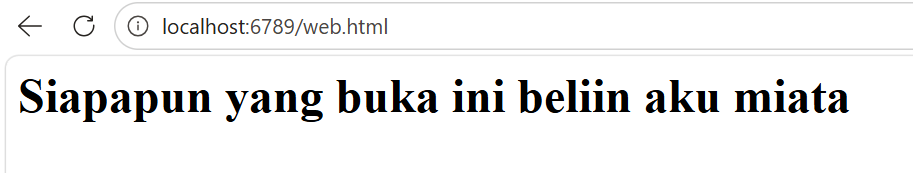
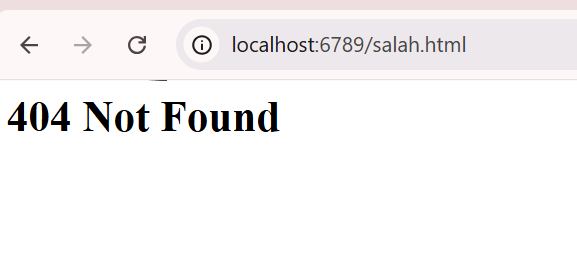
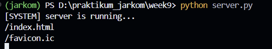
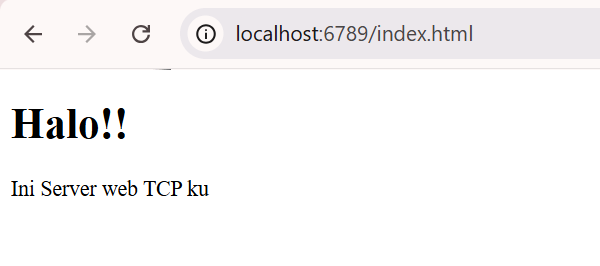

### **Difa Auliya Andini Putri - 103072400112**

# **Laporan Praktikum Modul 9: Web Server**

### **Tujuan Praktikum**
1. Mampu membuat program Web Server sederhana berbasis TCP Socket Programming
2. Memahami mekanisme HTTP Request dan HTTP Response
3. Memahami komunikasi browser dan server menggunakan protokol TCP

### **Web Server Sederhana**
Web Server adalah sistem yang bertugas menerima permintaan (request) dari client (browser) melalui protokol HTTP, kemudian memberikan respon berupa halaman web atau file yang diminta. Dalam praktikum ini, Web Server dibangun menggunakan socket TCP karena HTTP berjalan di atas protokol TCP yang bersifat connection-oriented dan reliable.

Saat browser mengakses alamat seperti http://localhost:6789, browser akan mengirim HTTP Request (biasanya GET) ke server. Server membaca request tersebut, mencari file yang diminta (misalnya web.html), lalu mengirimkan HTTP Response beserta isi file HTML. Jika file tidak ditemukan, server mengirim pesan 404 Not Found.

**serverweb.py :**
```python
from socket import *
serverSocket = socket(AF_INET, SOCK_STREAM)

serverPort = 6789
serverSocket.bind(('', serverPort))
serverSocket.listen(1)

while True:
    print('Ready to serve...')
    connectionSocket, addr = serverSocket.accept()
    
    try:
        message = connectionSocket.recv(1024).decode()
        
        filename = message.split()[1]
        
        f = open(filename[1:])
        outputdata = f.read()

        connectionSocket.send("HTTP/1.1 200 OK\r\n\r\n".encode())

        for i in range(0, len(outputdata)):
            connectionSocket.send(outputdata[i].encode())
            
        connectionSocket.close()

    except IOError:
        connectionSocket.send(
            "HTTP/1.1 404 Not Found\r\n\r\n".encode()
        )
        connectionSocket.send("<html><body><h1>404 Not Found</h1></body></html>".encode())

        connectionSocket.close()

serverSocket.close()
```

1. from socket import * → Mengimpor seluruh fungsi socket Python
2. socket(AF_INET, SOCK_STREAM) → Membuat socket TCP berbasis IPv4
3. serverPort = 6789 → Menentukan port server
4. bind(('', serverPort)) → Menghubungkan server ke semua interface pada port tertentu
5. listen(1) → Server menunggu satu koneksi client dalam satu waktu
6. accept() → Menerima koneksi dari browser/client
7. recv(1024).decode() → Menerima HTTP Request dari browser
8. message.split()[1] → Mengambil nama file dari request (misalnya /index.html)
9. open(filename[1:]) → Membuka file yang diminta client
10. read() → Membaca isi file HTML
11. send("HTTP/1.1 200 OK") → Mengirim status sukses
12. for loop send() → Mengirim isi file per karakter ke browser
13. except IOError → Menangani file yang tidak ditemukan
14. 404 Not Found → Mengirim response error
15. close() → Menutup koneksi setelah selesai

**web.html:**
```html
<h1>Siapapun yang buka ini beliin aku miata</h1>
               
```

setelah itu jalankan code di terminal : <br>
<br>

lalu buka browser dan ketik URL: http://localhost:6789/web.html :<br>
<br>

lalu buka browser dan ketik URL: http://localhost:6789/salah.html :<br>
<br>

### **Cara Kerja Program :**
Program dimulai dengan membuat server socket berbasis TCP menggunakan IPv4, kemudian server dibind ke port 6789 agar dapat menerima koneksi dari browser. Setelah itu, server masuk ke kondisi listening dan menunggu request dari client. Ketika browser mengakses localhost:6789, browser akan mengirimkan HTTP Request ke server, misalnya GET /web.html HTTP/1.1. Server menerima pesan tersebut, lalu mengambil nama file yang diminta menggunakan split(). Selanjutnya, server mencoba membuka file HTML dari direktori lokal. Jika file berhasil ditemukan, server membaca seluruh isi file dan mengirimkan HTTP Response dengan status 200 OK, kemudian isi file dikirim ke browser sehingga halaman web dapat ditampilkan. Jika file tidak ditemukan, program akan masuk ke blok except IOError dan mengirimkan response 404 Not Found. Setelah proses selesai, koneksi client ditutup dan server kembali menunggu koneksi baru. Skeleton ini menunjukkan implementasi dasar bagaimana Web Server bekerja menggunakan mekanisme request-response melalui protokol HTTP di atas TCP.


### **Latihan Tambahan - Multithread**
Pada latihan tambahan, Web Server dikembangkan dari skeleton dasar menjadi server yang mampu menangani banyak client secara bersamaan menggunakan multithreading. Dengan threading, setiap client yang terhubung akan diproses pada thread terpisah sehingga server tidak perlu menunggu satu client selesai terlebih dahulu sebelum melayani client lain.

**server.py :**
```python
from socket import *
import threading

def handle_client(connectionSocket):
    try:
        message = connectionSocket.recv(1024).decode() 
        message = message[4:15]
        print(message)

        f = open(message[1:])
        outputData = f.read()

        connectionSocket.send("HTTP/1.1 200 OK\r\n\r\n".encode())
        connectionSocket.sendall(outputData.encode())
        connectionSocket.close()
    
    except IOError:
        connectionSocket.send(
            "HTTP/1.1 404 Not Found\r\n\r\n".encode()
        )
        connectionSocket.send("<h1>404 Not Found</h1>".encode())
        connectionSocket.close()


serverSocket = socket(AF_INET, SOCK_STREAM)
serverSocket.bind(('', 6789))
serverSocket.listen(5) 
print("[SYSTEM] server is running...")

while True:
    connectionSocket, addr =  serverSocket.accept()
    thread = threading.Thread(
        target = handle_client,
        args = (connectionSocket,)
        )

    thread.start()
```

1. import threading → Mengimpor library threading untuk menjalankan banyak client secara paralel
2. handle_client(connectionSocket) → Fungsi khusus untuk menangani request dari setiap client
3. recv(1024).decode() → Menerima HTTP Request dari browser/client
4. message[4:15] → Mengambil nama file dari request HTTP (contoh: /index.html)
5. open(message[1:]) → Membuka file HTML yang diminta
6. read() → Membaca isi file HTML
7. send("HTTP/1.1 200 OK") → Mengirim status sukses ke browser
8. sendall() → Mengirim seluruh isi file HTML
9. except IOError → Menangani jika file tidak ditemukan
10. 404 Not Found → Mengirim halaman error
11. listen(5) → Server dapat menerima hingga 5 antrean client
12. threading.Thread() → Membuat thread baru untuk setiap koneksi client
13. thread.start() → Menjalankan thread sehingga banyak client dapat dilayani bersamaan

**index.html:**
```html
<!DOCTYPE html>
<html lang="id">
<head>
    <title>Tugas Modul 9</title>
</head>
<body>
    <h1>Halo!!</h1>
    <p>Ini Server web TCP ku</p>
</body>    
</html>                 
```

1. DOCTYPE html → Mendefinisikan dokumen HTML5
2. html → Root dari halaman web
3. head → Berisi metadata halaman
4. title → Judul tab browser
5. body → Isi utama halaman
6. h1 → Heading utama
7. p → Paragraf teks

setelah itu jalankan code di terminal : <br>
<br>

lalu buka browser dan ketik URL: http://localhost:6789/index.html :<br>
<br>


### **Cara Kerja Program :**
Pada program ini, server dibuat menggunakan socket TCP dan dibind ke port 6789 agar dapat diakses melalui browser. Setelah server aktif, server akan terus menunggu koneksi dari client menggunakan accept(). Ketika ada client yang terhubung, server tidak langsung memproses client tersebut di main program, melainkan membuat thread baru yang menjalankan fungsi handle_client(). Di dalam fungsi tersebut, server menerima HTTP Request dari browser, mengambil nama file HTML yang diminta, lalu mencoba membuka file tersebut dari direktori lokal. Jika file berhasil ditemukan, server membaca isi file dan mengirimkan HTTP Response dengan status 200 OK beserta isi halaman web ke browser. Jika file tidak ditemukan, server mengirimkan response 404 Not Found. Setelah request selesai diproses, koneksi client ditutup. Karena setiap client dijalankan pada thread yang berbeda, server dapat melayani beberapa client secara bersamaan tanpa harus menunggu proses client lain selesai terlebih dahulu. Hal ini membuat server lebih efisien dibanding skeleton dasar yang hanya melayani satu client per waktu.


